# TSRPC + Cocos，多人实时对战 So Easy！

:::note 内容介绍
❓ 帧同步和状态同步可以并用？<br/>
❓ 200ms 毫秒延迟也能实现单机游戏般的丝滑流畅？<br/>
❓ 有延迟的情况下怎么实现技能判定？<br/>

先看 Demo：<br/>
https://tsrpc.cn/fight/index.html<br/>
可邀请好友或浏览器多开体验多人对战效果
:::

多人实时对战一直是游戏开发领域的一块硬骨头。听起来不简单，做好了更难。
但时代在进步，技术在发展。就像 Cocos Creator 让游戏开发变得更简单了一样，
基于最新的技术栈和理解，多人实时对战的门槛也一直在降低。

2021 年 12 月 4 日，有幸作为嘉宾参加了深圳站的 Cocos Star Meeting 线下交流会，
就 “多人实时对战” 这个领域结合历经 5 年沉淀的开源框架 TSRPC 进行了一些分享。

以下是本次分享内容的文字实录。

<!--truncate-->

## 自我介绍

大家好，首先简单自我介绍一下。我是 **King 王忠阳**，Github ID 是 k8w。

曾经是腾讯互娱的一名老鹅，也是一枚老全栈。
2016 年时发现了 TypeScript，开始用它进行全栈开发，之后就真香得一发不可收拾。
2017 年，[TSRPC](https://tsrpc.cn) 1.0 第一次出现在了 Github 上。历经 5 年的沉淀发展，如今已进入 3.x 版本。

现在我的主要时间精力投入在开源项目 TSRPC 的开发和维护上，也提供一些技术咨询服务。欢迎大家关注我的公众号 / B站 / 知乎专栏 / 掘金 —— **TypeScript全栈开发** 。

## 目录

那么接下来进入今天的主题 —— TSRPC + Cocos，多人实时对战 So Easy！

我将主要分为 3 个部分介绍：

- **同步策略**
    - 介绍在有网络延迟的情况下，优化实时对战体验的方法
- **网络通信**
    - 细数网络通信的痛点，并介绍终极解决方案 —— TSRPC
- **项目实战**
    - 从零开始实现一个疯狂打群架多人版，看看是不是 So Easy
- **额外内容**
    - 补充一些在线下分享时没有提到的一些实用内容

## 同步策略

说起 “多人实时对战” 首先就会想到 “同步”，那么说起 “同步” 你又最先想到什么呢？

### 帧同步 vs 状态同步？

没错，很多人会想到 **帧同步** 和 **状态同步**。
有关它们，你可以搜索到大量的介绍，比如：

| | 传输内容 | 逻辑计算 | 断线重连 | 回放/观战 |
| - | - | - | - | - |
| 帧同步 | 操作 | 客户端 | 追历史帧 | 天然支持 |
| 状态同步 | 结果 | 服务端 | 下次同步 | 另外实现 |

但首先，我想更正大家一个常见的误区。

很多时候我们都在讨论 “该用帧同步还是状态同步”，似乎这已经变成了一个非此即彼、二选一的问题。
但事实上，帧同步和状态同步不但 **不是** 二选一的关系，甚至可以 **相互替代** 和 **混合使用**。

因为，**帧同步和状态同步最终都是同步状态。**

假设我们要实现一堆人在一个房间里跑，无论你用状态同步 —— 直接发送你的坐标，或是帧同步 —— 发送移动操作再由客户端计算出最终坐标，对于表现层组件而言，需要的都是你的最终状态 —— 位置坐标。
所以实际上帧同步和状态同步更多讨论的是，网络传输什么，状态在哪里计算 —— 看起来更像一个成本问题。

只需确保你的状态计算逻辑在前后端都可运行，那么帧同步或状态同步就是可以并用或随时切换的。

### 同步状态

> 帧同步和状态同步都是同步状态。

首先来看看最简单、没有任何优化策略下，状态是怎么被同步的。

1. 本地按下按键，发出操作指令。
2. 指令发送给服务器，服务器得到最新状态，并广播给所有人。
    - 帧同步广播操作指令，状态同步广播结果
3. 前端收到服务器的发送来的新状态后，刷新界面显示。

效果如图。（上面是自己的视角，中间是服务器，下面是其它玩家视角）

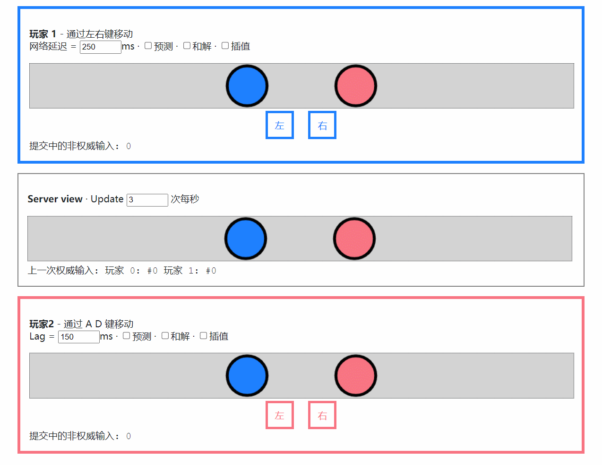

很明显，有几个问题：
1. **操作延迟**
    - 由于网络延迟，按下左/右按键后，总要过一会才能收到服务器的返回，导致操作延迟，体验很差
2. **卡顿**
    - 由于服务器同步的逻辑帧率（每秒 3 次）慢于显示帧率（每秒 60 帧），导致位移一卡一卡的，不流畅

但网络延迟一定客观存在，同步帧率和显示帧率也未必一致。所以我们需要一种办法，能够在有延迟、有卡顿的情况下，还能实现感觉不到延迟、并且丝滑流畅的体验。这就是同步的魔术 —— 同步策略。

### 同步策略

网络延迟是客观存在的，所以同步策略本质上是一种魔术，要在有延迟的情况下实现没有延迟的错觉。根据项目，主要有几种类型。

首先根据同步节奏分为快慢两种。

#### 慢节奏

同步间隔在 1~2 秒甚至更久，例如打牌、下棋等。
这种情况非常简单，只需在表现层面优化，做到 **即时反馈** 即可。
例如五子棋，当玩家点下鼠标按钮时，无需等到服务器返回才显示落子，而是立即显示落子，并发出 “啪” 的一声清脆的回响，给玩家一个即时的操作反馈。
可能实际上服务器延迟了 1 秒，但玩家是毫无感知的。

#### 快节奏

同步间隔较短，例如要实现咱们在一屋子里乱跑。那么这个也分情况，无冲突和有冲突的。

如果我们都是幽灵，那么就是无冲突的。因为我们的身体是虚无的，可以互相穿透。你的位置只受你自己控制，任何其它因素都影响不了，这个就叫无冲突。
那这个实现方案就非常简单 —— 你自己和其它人区别对待。你自己就实现为一个单机游戏，无论做了任何移动操作，都立即应用到表现层，只是将这些信息同步发送给服务端。其它人呢，就是收到服务端的信息，然后把它们的变化当动画一样播放出来就可以。当然，因为网络延迟的关系，你看到的可能是其它人 5 秒、10 秒前的状态了。可是那有什么关系呢？在幽灵这个无冲突的设定下，不会有任何影响，反而所有人都获得了单机游戏般丝滑流畅无延迟的体验，大家都很开心。

但另一种情况则不同，如果我们都是血肉之躯，会发生实际的物理碰撞，我站在这里你就不可能再站在相同的位置。这种情况就称为有冲突。**快节奏有冲突** 的同步策略会相对复杂一些，接下来着重介绍。

## 快节奏有冲突的同步策略

解决快节奏有冲突的同步策略，核心就是 3 个关键词：**预测、和解、插值** 。
理解了这 3 个概念，任何情况的同步对你来说应该都是游刃有余。
不过在此之前，让我们先看看逻辑与表现分离的架构。

### 逻辑与表现分离

多人实时游戏，通常会划分为表现层和逻辑层。
表现层指游戏画面的显示和用户输入的获取；
逻辑层指渲染无关的、只关注状态变化和计算的玩法逻辑。

逻辑层和表现层最终是面向数据的，例如玩家的位置、生命值等，我们把这些数据统称为 **状态**。
我们把所有能影响状态变化的因素称为 **输入**，例如玩家操作（如移动）、系统事件（如天上打雷了）、时间流逝等等。

逻辑层就是定义所有状态和输入，然后实现状态变更的算法：

```
新状态 = 老状态 + 输入1 + ... + 输入N
```

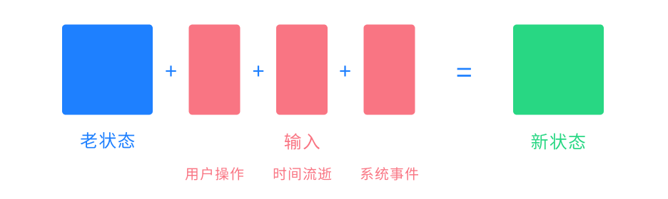

:::info 重要
逻辑层本质上就是一个状态机。
:::

在实现逻辑层的过程中，有几个重要的点需要关注：

- **无输入，不变化**：状态变更仅发生在输入时刻，没有输入时状态不会改变
- **无外部依赖**：状态计算应该没有任何外部依赖，例如 `Date.now()`、`Math.random()` 等，所有这些都应该显式成为输入的一部分
- **结果的一致性**：在相同的状态和输入下，得到的新状态应该是一致的

:::tip
像随机数这类场景，可以通过伪随机数生成器实现，在相同的种子输入下，随机结果应该是一致的。
:::

在逻辑层的状态计算基础之上，预测、和解、插值就更容易理解了。

### 预测

**预测就是将玩家的输入立即应用到本地状态，而无需等待服务端返回。**

如果玩家的每一次操作如果都要等到服务端确认后才能生效，那么延迟将是不可避免的。
解决方案就是：玩家做出任何操作后，立刻将输入应用到本地状态，并刷新表现层显示。
例如按下了 “右”，那么就立即向右移动，而无需等待服务端返回，效果如图。

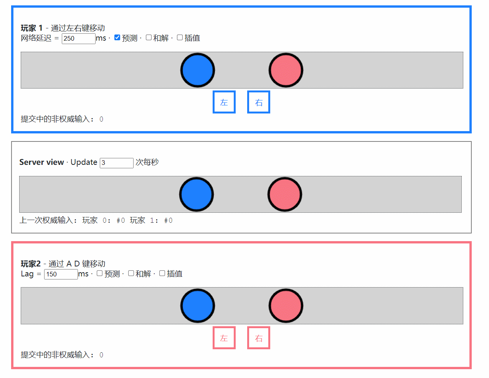

现在，操作的延迟消失了。你按下 “左” 或者 “右” 都可以得到立刻的反馈。

但问题似乎并没有完全解决，在移动过程中，你总是能感到来回的 “拉扯” 或者位置抖动。
这是因为你在执行本地预测的时候，也在接收来自服务端的同步，而服务端发来的状态总是滞后的。

例如：
1. 你的坐标是 `(0,0)`
1. 你发出了 2 个 `右移` 指令（每次向右移动 1 个单位），服务器尚未返回，执行本地预测后，**坐标变为 `(2,0)`**
1. 你又发出了 2 个 `右移` 指令，服务器尚未返回，执行本地预测后，**坐标变为 `(4,0)`**
1. 服务端发回了你的前 2 个右移指令：从 `(0,0)` 执行 2 次右移，**坐标变为 `(2,0)`，被拉回之前的位置**

由于延迟的存在，服务端的同步总是滞后的，所以你总是被拉回之前的位置。如此往复，就是你在图中看到的抖动和拉扯。

归根到底，是服务端同步过来的状态与本地预测的状态不一致，所以我们需要 “和解” 它们。

### 和解

**和解就是一个公式：预测状态 = 权威状态 + 预测输入**

:::info 重要
和解的概念最难理解，但也是实现无延迟感体验最重要的一步。你可以先简单记住上面的公式，应用到项目中试试看。
:::

#### 权威和预测

一般我们认为服务器总是权威的，从服务端接收到的输入称为 **权威输入**，经权威输入计算出来的状态称为 **权威状态**。
同样的，当我们发出一个输入，但尚未得到服务端的返回确认时，这个输入称为非权威输入，也叫 **预测输入**。

在网络畅通的情况下，预测输入迟早会按发送顺序变成权威输入。我们需要知道发出去的输入，哪些已经变成了权威输入，哪些还是预测输入。在可靠的传输协议下（例如 WebSocket）你无需关注丢包和包序问题，所以只需简单地对比消息序号即可做到。

#### 和解过程

在前述预测的基础上，和解就是我们处理服务端同步的状态的方式。如果使用的是状态同步，那么这个过程是：

1. 收到服务端同步来的 **权威状态**
1. 将本地状态立即设为此权威状态
1. 在权威状态的基础上，应用当前所有 **预测输入**

如果使用的是帧同步，那么这个过程是：

1. 收到服务端同步来的**权威输入**
1. 将本地状态立即 **回滚** 至 **上一次的权威状态**
1. 将权威输入应用到当前状态，得到此次的 **权威状态**
1. 在权威状态的基础上，应用当前所有 **预测输入**

由此可见，状态同步和帧同步只是网络传输的内容不同，但它们是完全可以相互替代的 —— 最终目的都是为了同步权威状态。

#### 例子

这有用吗？我们回看一下上面预测的例子，有了和解之后，会变成怎样：

1. 你的坐标是 `(0,0)`
1. 你发出了 2 个 `右移` 指令（每次向右移动 1 个单位），服务器尚未返回
    - 权威状态：`(0,0)`
    - 预测输入：`右移#1` `右移#2`
    - 预测状态：`(2,0)` （权威状态 + 预测输入）
1. 你又发出了 2 个 `右移` 指令，服务器尚未返回
    - 权威状态：`(0,0)` （未收到服务端同步，不变）
    - 预测输入：`右移#1` `右移#2` `右移#3` `右移#4`
    - 预测状态：`(4,0)` （权威状态 + 预测输入）
1. 服务端发回了你的前 2 个右移指令 （帧同步）
    - 上一次的权威状态：`(0,0)`
    - 权威输入：`右移#1` `右移#2`
    - 权威状态：`(2,0)` （上一次的权威状态 + 权威输入）
    - 预测输入：`右移#3` `右移#4` （`#1`、`#2` 变成了权威输入）
    - 预测状态：`(4,0)` （权威状态 + 预测输入，**之前的拉扯不见了**）

看！虽然服务端同步来的权威状态是 “过去” 的，但有了和解之后，拉扯问题解决了，效果如图：


预测 + 和解处理本地输入是非常通用的方式。你会发现，在没有冲突时，网络延迟可以完全不影响操作延迟，就跟单机游戏一样！
例如上面移动的例子，如果不发生冲突（例如与它人碰撞），即便网络延迟有 10 秒，你也可以毫无延迟并且平滑的移动。
这就是在有延迟的情况下，还能实现无延迟体验的魔术。

#### 冲突

那么冲突的情况会怎样呢？比如上面的例子，你发送了 4 次移动指令，但在服务端，第 2 次移动指令之后，服务端插入了一个新输入 —— “你被人一板砖拍晕了”。这意味着，你的后两次右移指令将不会生效（因为你晕了）。
那么该过程会变成这样：

1. 你的坐标是 `(0,0)`
1. 你发出了 2 个 `右移` 指令（每次向右移动 1 个单位），服务器尚未返回
    - 权威状态：`(0,0)`
    - 预测输入：`右移#1` `右移#2`
    - 预测状态：`(2,0)`
1. 你又发出了 2 个 `右移` 指令，服务器尚未返回
    - 权威状态：`(0,0)`
    - 预测输入：`右移#1` `右移#2` `右移#3` `右移#4`
    - 预测状态：`(4,0)`
1. 服务端发回了你的前 2 个右移指令
    - 权威状态：`(2,0)`
    - 预测输入：`右移#3` `右移#4` （`#1`、`#2` 变成了权威输入）
    - 预测状态：`(4,0)`
1. 服务端发回了与预期冲突的新输入
    - 上一次的权威状态：`(2,0)`
    - 权威输入：`你被拍晕了` `右移#3` `右移#4`
    - 权威状态：`(2,0)` （因为先被拍晕了，所以后两个右移指令无效）
    - 预测输入：无 （所有预测输入都已变为权威输入）
    - 预测状态：`(2,0)`

此时，之前的预测状态 `(4,0)` 与最新的预测状态 `(2,0)` 发生了冲突，客户端当然是以最新状态为主，所以你的位置被拉回了 `(2,0)` 并表现为晕眩。这就是网络延迟的代价 —— 冲突概率。

### 插值

**插值指在表现层更新 “其它人” 的状态变化时使用插值动画去平滑过渡。**

到目前为止，我们已经获得了自己在本地无延迟的丝滑体验。但在其它玩家的眼中，我们依旧是卡顿的。这是由于同步帧率和显示帧率不一致导致的，所以我们在更新其它人的状态时，并非一步到位的更新，而是通过插值动画来平滑过渡。

:::info 重要
预测+和解是解决 **自己** 的问题，发生在 **逻辑层**；插值是解决 **其它人** 的问题，发生在 **表现层** 。
:::

例如上面的例子，显示帧率是 30fps，服务端的同步帧率是 3 fps。收到服务端同步的其它玩家的状态后，不是立即设置 `node.position`，而是通过 `Tween` 使其在一个短暂的时间内从当前位置平滑移动到新位置。
如此，在其它玩家眼中，我们看起来也是平滑的了：

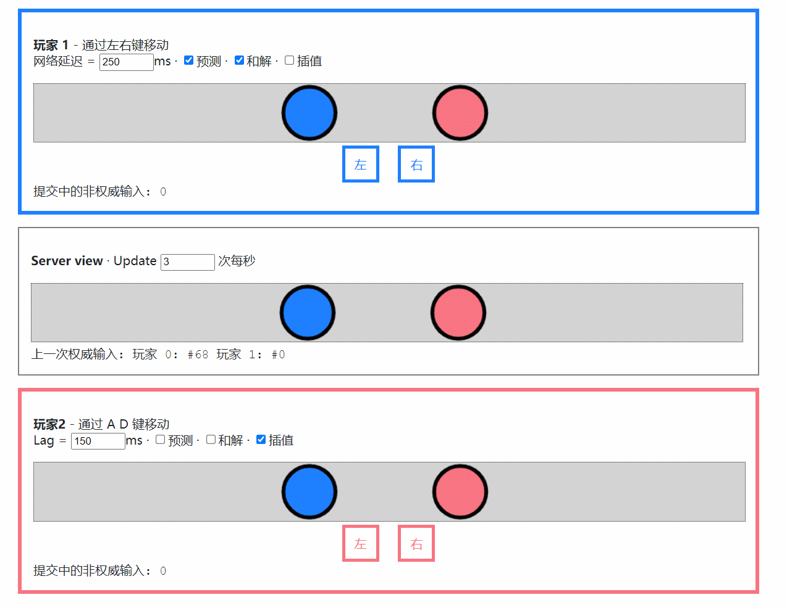

解决快节奏有冲突的同步，就是 **预测、和解、插值** 这 3 个核心思想，掌握了它们你应该就能举一反三，轻松应对各种场景。

## 网络通信

有了思想，我们现在要开始动手写一个多人实时对战的项目了。在动手层面挡在我们面前的第一个问题是什么呢 —— 网络通信。
在网络通信这个领域其实我们一直是很难受的，因为一直有很多痛点，但是我们可能已经习惯了。

### 定义协议之痛

要通信首先要定义协议，就是指在服务端和客户端之间你要发送的是什么，常见的有几种方式。

#### 1. 通过文档定义

很多项目组通过文档来定义协议，问题显而易见。
由于文档没有强类型保证，拼写错误、字段类型错误等低级错误频发。
协议变更时，文档和代码不一致的情况更是时有发生。
不得不花费大量时间联调，但解决的只是这些低级错误，风险大，效率低。

#### 2. 使用 Protobuf

Protobuf 是游戏行业常用的工具，使用它能完成运行时类型检测和二进制序列化。缺点就是它的类型是通过一门独立的语言来定义的，会增加不少额外的学习成本。由于语言不同，Protobuf 也无法完全发挥 TypeScript 的类型特性，例如 `A & (B | C)` 这样常见的高级类型特性就无法使用了。

#### 3. 使用 TypeScript

直接使用 TypeScript 的类型来定义协议，不但方便，还能在前后端共享，利于代码提示。但 TypeScript 的类型系统仅在编译时刻生效，并无运行时支持，对于不可靠的用户输入这将有很大安全风险。并且也无法像 Protobuf 那样完成二进制序列化。

### 多种通讯模型

在一个多人实时游戏的网络通信中，我们会以多种方式处理网络请求。

例如调用 API 接口，这是基于 **请求/响应** 模型的用法。例如登录、注册等接口，在 Web 应用中常常使用 HTTP 短连接来实现。

但也存在例如服务端推送、流式传输等，基于 **发布/订阅** 模型的用法。
例如帧同步广播、聊天消息广播等，常常使用 WebSocket 长连接来实现。

HTTP 常用 `ExpressJS` 等框架，而 WebSocket 常用 `SocketIO` 等框架。二者框架、API、技术方案均不一致，常常不得不拆分为多个不同项目。但实际上它们的业务逻辑又高度雷同，这导致统一维护难，学习成本高。

### 安全 安全 安全

重要的事情说三遍：安全！安全！安全！
游戏行业最怕什么？外挂。

#### 抓包破解

目前，Web 应用大多通过 JSON 字符串来传输。
明文的 JSON 太容易被抓包和破解，这对于游戏来说是灾难性的。
而字符串加密的算法本身十分有限，很多项目组选择转为 base64 字符串，但这将显著增大包体。

#### 低级错误

```
100 + '100' === '100100'
```

应该传数字却不小心传了字符串？小小的类型错误可能导致很严重的后果。
墨菲定律告诉我们，可能犯错的一定会犯错。仅仅依靠人工来保证类型安全，是不可靠的。

#### 安全隐患

用户的输入总是不可靠的！请求参数的类型非法以及字段过滤不严格，都可能导致严重的安全隐患！
例如有一个更新用户信息的接口 `user/Update`，其请求格式定义为：

```ts
export interface ReqUpdate {
    id: number,
    update: {
        nickname?: string,
        avatar?: string
    }
}
```

如果客户端构造了一个恶意请求，在 `update` 中包含了一个不应该出现的敏感字段 `role`：
```json
{
    "id": 123,
    "update": {
        "nickname": "test",
        "role": "超级管理员"    // 敏感字段，不在协议中，不允许更新！
    }
}
```

**后端极有可能因为检查不严格，而导致安全隐患！**

### 所以

我们无法找到一个能完美解决这些问题的现成框架，
于是我们全新设计和创造了 **TSRPC**。
至今已经历时 5 年，经多个千万级用户项目验证。

## TSRPC

接下来就来介绍，**专为 TypeScript 设计、更适合 Cocos 的 RPC 框架 —— TSRPC** 。

- 官网：https://tsrpc.cn
- 文档：https://tsrpc.cn/docs/introduction.html
- 例子：https://github.com/k8w/tsrpc-examples
- Github：https://github.com/k8w/tsrpc  (求小星星~)

### 专为 TypeScript 设计

TSRPC 是专为 TypeScript 设计的，所以天然更适合 Cocos。

- 🔥 可直接使用 TypeScript 类型定义协议
    - 无需装饰器、注解、Protobuf
    - 支持 TypeScript 高级类型特性，如 `A & (B | C)`、`Pick`、`Omit`、复杂嵌套引用等
    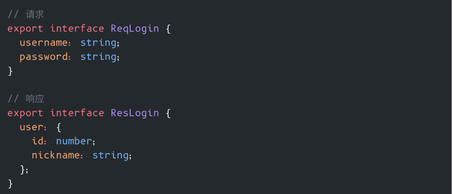
- 🔥 运行时类型安全
    - 根据 TypeScript 类型定义，在运行时自动校验请求和响应类型
    - 将类型非法的请求自动拦截
- 🔥 支持二进制序列化
    - 可将 TypeScript 类型直接编码为二进制
    - 编码效率近似于 Protobuf，且支持 TypeScript 高级类型
- 🔥 前后端全程代码提示
    - 在前后端复用代码和类型定义的全栈架构
    - 全程代码提示，避免低级错误
    

### 传输协议无关的架构

TSRPC 一开始就被设计为 **传输协议无关的架构** 。

这意味着你可以只编写一套代码，即可 **同时运行在 HTTP 短连接和 WebSocket
长连接之上** 。不必再拆分项目，而是可以在一个项目中同时使用长短连接。
同时，也可以方便的将 TSRPC 扩展到 UDP、IPC、甚至 Web Worker 等任意信道上。

TSRPC 还支持 **多种传输格式**，你可以自由选择是使用二进制编码传输（包体更小），还是 JSON 传输（更通用）。
并且 TSRPC 还支持你在协议中 **直接使用** `ArrayBuffer`、`Date`、`ObjectId` 这样 JSON 无法支持的类型，即便你选择使用 JSON 传输也支持！框架会在传输前后自动帮你完成类型的转换，收发二进制数据也变得更佳简单。

### 其它特性

- 跨平台
    - 支持 浏览器、小程序、小游戏、App 等多个平台
    - 支持 NodeJS 纯后端微服务调用
- 支持 Serverless 云函数部署
- 一键生成 Swagger / OpenAPI / Markdown 格式接口文档
- 成熟、可靠、高性能
    - 多个千万级用户线上项目验证

### 资源链接

了解更多特性和使用方式，可查看

- 官网：https://tsrpc.cn
- 文档：https://tsrpc.cn/docs/introduction.html
- 例子：https://github.com/k8w/tsrpc-examples
- Github：https://github.com/k8w/tsrpc  (求小星星~)

:::note 欢迎扫码加入微信交流群

:::

## 项目实战

有了思路，也解决了网络通信的问题，接下来我们从零开始，从前端到后端，去完整实现一个多人对战游戏的例子，看看是不是 So Easy。

### Demo 演示

首先来看看成品，这个例子我一个人花了 2 天半的时间就搞出来了，Github 有记录可查哈。

- 体验地址：https://tsrpc.cn/fight/index.html
- 源代码：https://github.com/k8w/tsrpc-examples/tree/main/examples/cocos-creator-multiplayer

<video src={require('./assets/demo-preview.mp4').default} style={{maxWidth: 375}} autoPlay loop controls="controls"></video>

看着是不是眼熟？对的，就是前阵子 Cocos 商店新上架的 “疯狂打群架”，我第一时间就抢购了。然后这个 Demo 就是拿疯狂打群架的资源去改了一个多人版本，它主要是 2 个简单的玩法：

1. 一群人在场景里面跑
1. 可以射箭，被戳到的人会原地晕眩 1 秒钟，期间无法移动

运用了上面所说的 预测+和解+插值 之后，看看是什么效果。

#### 本地无延迟跑动

<video src={require('./assets/demo-delay.mp4').default} style={{maxWidth: '100%'}} autoPlay loop controls="controls"></video>

如上面视频，中间的设备是有 200ms 网络延迟的，你可以明显的看到它的画面和左右两边不同步。但是呢，对于他自己而言，他的操作是一点延迟都没有的，他完全感受不到这 200ms 的存在，这就是预测+和解的魔术。

#### 位置冲突

<video src={require('./assets/demo-collision.mp4').default} style={{maxWidth: '100%'}} autoPlay loop controls="controls"></video>

射箭+晕眩这个玩法，是可能会导致冲突的一个点。

比如上面这个视频，中间的设备还是有 200ms 延迟。当他操作跑动出去的同时，有一根箭落在了他的起始位置。当然由于网络延迟的存在，他开始跑动的时候箭还没有射出来，于是根据本地预测的结果他跑了出去。当收到延迟的同步之后，服务端告诉它你在 200ms 前就已经被晕在原地了，是不可能跑出去的。所以他的位置被瞬间拉了回来并变成了晕眩状态，这个时候他可以明显的感受到似乎卡了一下。

### 帧同步和状态同步并用

这是一个典型的快节奏有冲突的同步，使用预测+和解+插值就能妥善的解决，
但还有另一项需求。

我希望进入房间后能立即开始游戏，而非像王者荣耀那样要从头开始回放追帧，那么意味着我在进入游戏这一刻要使用状态同步。

但我又希望网络传输的包体尽可能小，所以想要在游戏过程中传输操作而非完整状态，那么又需要在进入房间后，游戏过程中使用帧同步。

这是完全可行的。

### 全栈架构

实现多人游戏的关键就是逻辑和表现分离，逻辑是纯 TypeScript 代码，应当是平台无关、可以跨端复用的。
帧同步与状态同步并用，也相当于要同时在服务端（状态同步）和客户端（帧同步）计算游戏状态逻辑。因此，全栈的架构应该是这样的。

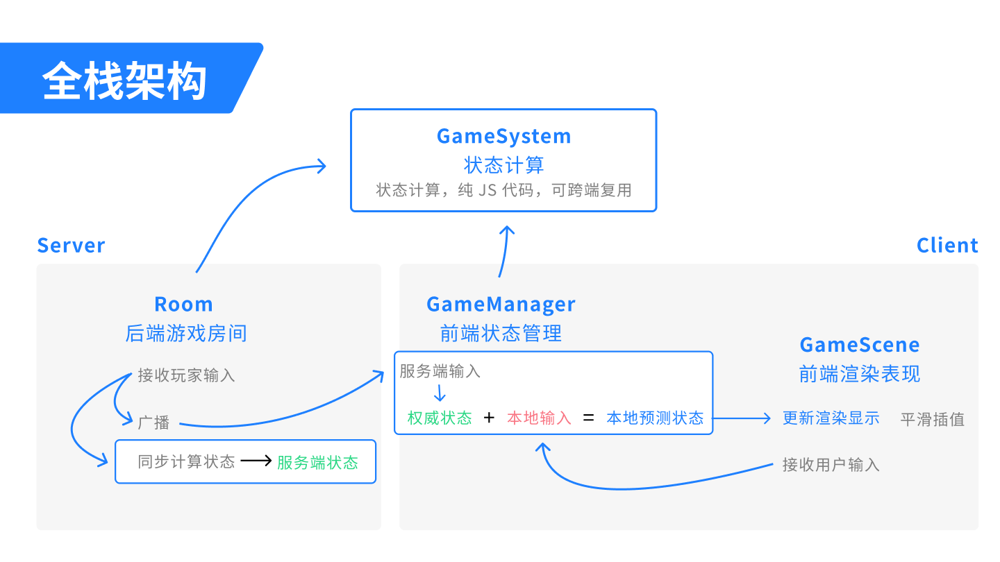

这张全栈架构图应该说就是我今天分享内容的 **核心**，你了解了这个流程，就能轻而易举的实现一样的效果。

它主要分为几块（英文名字随便取的），其实你单独看每一块都非常简单。

#### 跨端复用部分

- 状态计算 GameSystem
    - 定义状态和输入
    - 实现 `老状态 + 输入 = 新状态` 的算法

#### 服务端

- 游戏房间 Room
    - 接收玩家输入
    - 定期广播
    - 同步计算状态（调用 GameSystem）

#### 客户端

- 逻辑层（预测+和解） GameManager
    - 通过服务端输入计算权威状态
    - 权威状态 + 预测输入 = 本地预测状态
- 表现层 GameScene
    - 从逻辑层取状态，然后更新渲染显示
        - 直接更新自己
        - 平滑插值别人
    - 接收用户输入，发送给逻辑层

### TSRPC 全栈项目结构

上面提到，状态计算 GameSystem 这部分代码是要在前后端复用的。
除此之外，还有其它一些代码和类型定义可能我们希望在前后端共享。

TSRPC 从一开始就设计为面向全栈的结构，所以它已经内置了跨端跨项目共享代码的方案。默认是采用 Symlink 的方式，就类似我们 Windows 中的快捷方式。
比如我们这个 Demo 项目，它有 2 个目录 —— 后端项目 `backend` 和 前端项目 `frontend`，后端项目中有一个名为 `shared` 的目录，这个目录就是要跨端共享的内容。前端项目中也有一个 `shared`，但它是一个指向后端 `shared` 目录的 Symlink，就相当于一个快捷方式，你可以把它们理解为一个目录。当一边增加/修改文件时，另一边也是同步变化的。

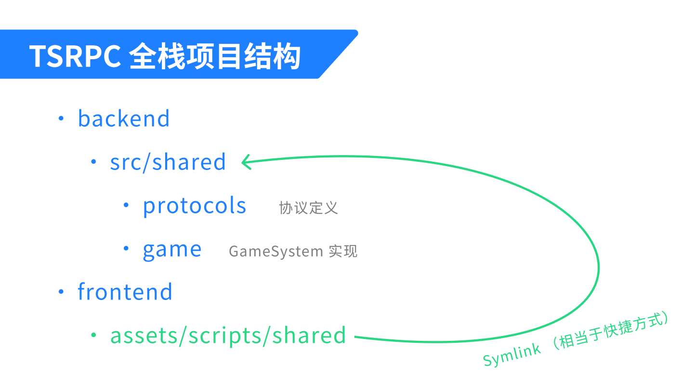

### 写状态计算

接下来开始写代码，首先来写状态计算 GameSystem，一共分 3 步：

1. 定义状态
1. 定义输入
1. 实现状态计算

#### 定义状态

在这个 Demo 里，主要的状态有 3 个：

- 当前时间 `now`
    - 很多游戏的玩法逻辑都与时间相关
    - 本 Demo 中箭矢落地的判定需要依赖它
- 所有玩家 `players`
    - 包括位置 `pos`
    - 以及晕眩状态，这里我用一个晕眩结束时间来表示
- 所有飞行中的箭矢 `arrows`
    - 包括落地时间和落点位置，通过它们来完成命中的判定

直接用 TypeScript 的类型来定义就行了，简单吧。

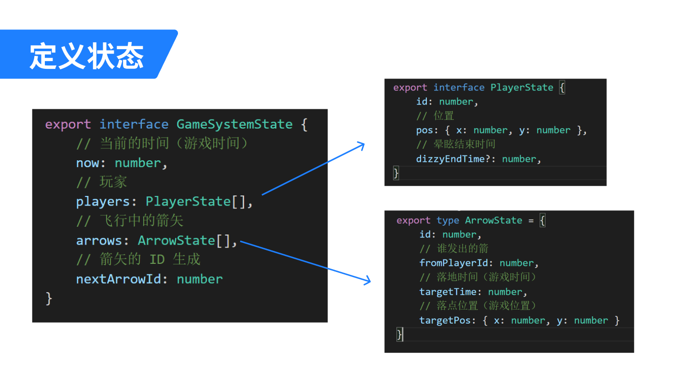

#### 定义输入

接下来，需要把所有可能影响状态变更的输入都定义下来，如下：

- 用户操作类
    - 移动
    - 攻击（放箭）
- 系统事件类
    - 玩家加入
    - 玩家离开
- 时间流逝
    - 以服务端同步为准

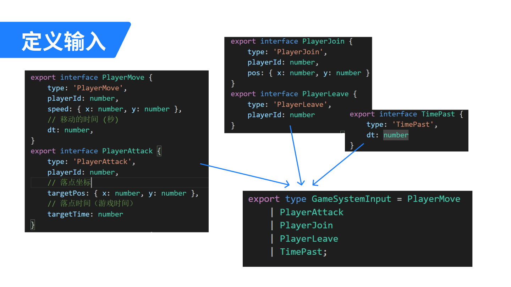

你可以分别定义，加入一个互斥的字段例如 `type`，然后用一个 TypeScript 的 Union 类型把它们合成一个类型。

:::tip
你在代码中定义的这些类型，可以直接用于 TSRPC 的网络通信~ 无需额外代价，就可以享受到运行时类型安全和二进制序列化特性。
:::

#### 实现状态计算

最后来实现状态计算算法，也就是我们说的 `GameSystem`，你可以用一个简单的 `class` 来封装：

- 一个成员变量 `state`，用于存储当前的状态
- 一个 `applyInput` 方法，传入输入，然后改变状态
    - 例如如果输入是 “新玩家加入”，则在 `state.players` 中增加一项
    - 如果输入是 “移动”，则更新对应玩家的 `pos` 位置状态

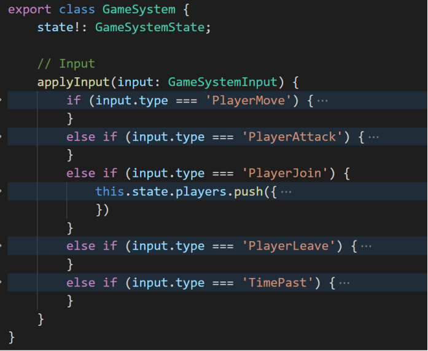

就这么简单~ 记得要确保原则：

- **无外部依赖**
    - 所有影响状态变更的因素都应该定义为输入，包括随机数、时间流逝等
- **无输入，不变化**
    - 仅当 `applyInput` 有输入时状态才会变更

### 写后端

后端主要任务就是接收玩家的输入，然后完成同步。

你可以选择接收到输入后就立即同步，或者是以 **LockStep** 的方式以固定频率同步。这里我选择了后者，同步频率设为了 10fps （即 100ms 间隔），这是因为对于这个玩法而言，100ms 延迟带来的冲突概率完全可以接受。

因为是 **固定频率同步**，所以收到玩家输入时什么也不做，只是把它们先 **临时存起来**：

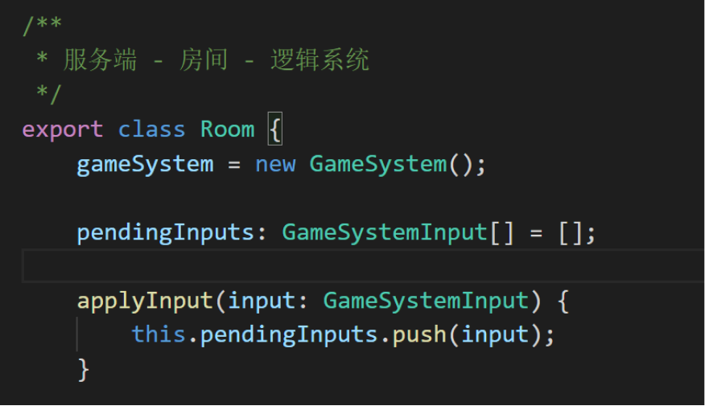

之后我有一个叫 `sync` 的方法，服务端会每 100ms 调用一次，它主要做了 2 件事：

- **计算状态**
    - 引用 GameSystem，在服务端也同步计算一份状态
    - 在新玩家加入时，一次性发送当前状态，完成初始状态同步
- **广播输入**
    - 将这一帧期间的所有输入广播给所有人

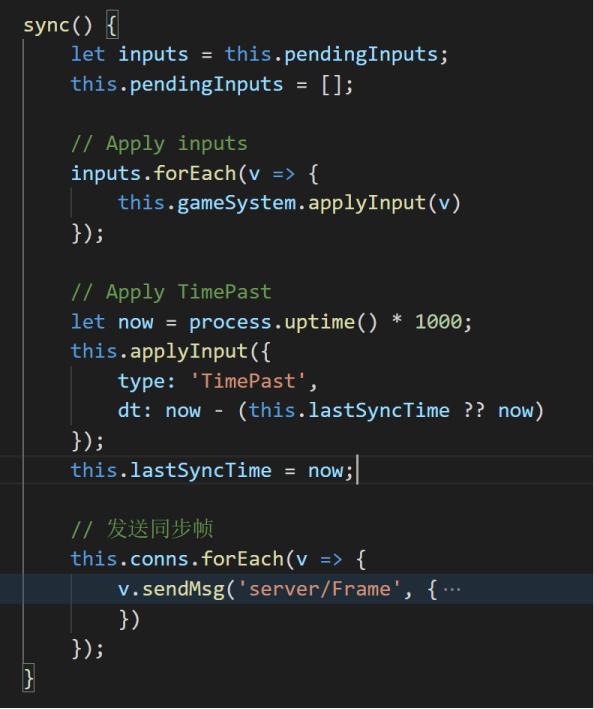

不要怀疑，就这么多代码，简单吧~

### 写前端逻辑层

接下来写前端逻辑层。
状态计算不是前后端复用的吗？为什么前端又多出来一个逻辑层呢？
这是因为前端显示的状态，并非直接是服务端发送来的状态（那样就是状态同步了）。
因为前端要做预测+和解的处理，所以在状态计算与表现层中间，还隔了一层前端的逻辑层。

前端的逻辑层就是用来完成 `权威状态 + 预测输入 = 本地预测状态` 这件事的，本质上就是处理来自前端和后端的输入。

**当接收到前端输入时**：

1. 将输入同步发送给服务端
1. 调用 GameSystem，将输入立即应用到本地状态

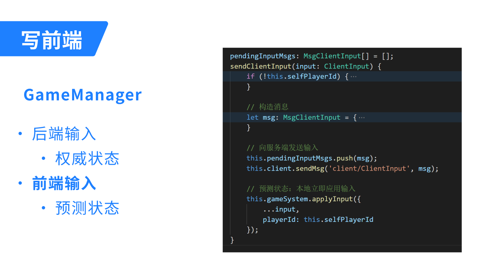

**当接收到后端输入时**：

1. 计算当前的权威状态
    - 先回滚到上一次的权威状态
    - 再将本次的权威输入应用计算，得到此次权威状态
1. 将本地预测输入应用计算，得到预测状态

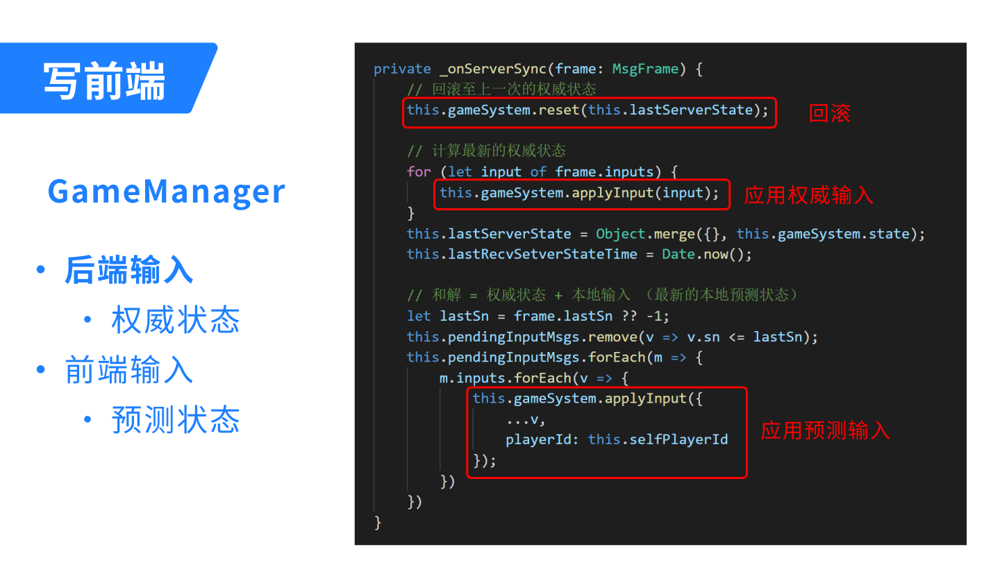

和解的概念虽然不太好理解，但是实现起来还是 So Easy 吧~

### 写前端表现层

最后就是实现前端表现层了，它的工作就是从 GameManager 取当前状态，然后显示之。

对于 **自己**，是通过预测+和解来更新状态的，不需要插值，所以直接一步到位重设状态即可，例如：

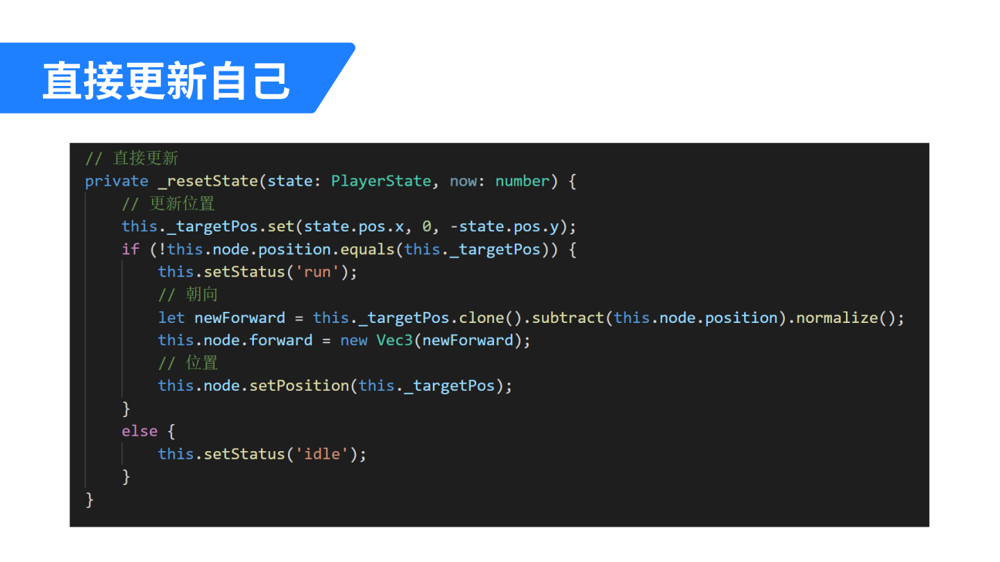

对于 **其它人**，则需要插值来平滑过渡，在 Cocos 中我们可以通过 `Tween` 来实现。只是记得，在每次 `Tween` 之前不要忘记先清理，因为网络抖动的关系，新的插值开始时上一次的插值可能尚未结束。

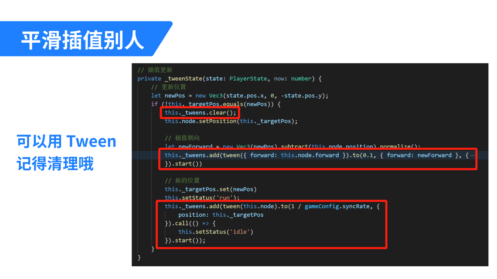

除此之外，可能有一些信息是体现在两帧状态变化之外的。
比如一颗炒鸡快的子弹，它瞬间被创造出来，击中敌人后又瞬间消失。那么在两帧的状态对比中，你仅仅知道敌人受到了伤害，却看不到这颗子弹。如果你需要利用这颗子弹的信息，比如画出一条弹道，那么有两种方式可以考虑：

1. 将子弹信息也记入状态，例如只记录上一帧期间出现的子弹
2. 在 GameSystem 中实现为事件，将转瞬即逝的信息通过事件的方式向外传递

例如 Demo 中的新箭矢出现，就是以事件的形式向表现层传递的。
表现层收到 “发射新箭矢” 的事件后只是一次性初始化了一个新的箭矢组件，它在空中的飞行动画等等完全是表现层的工作，箭矢创建后不需要再从 GameSystem 更新状态。

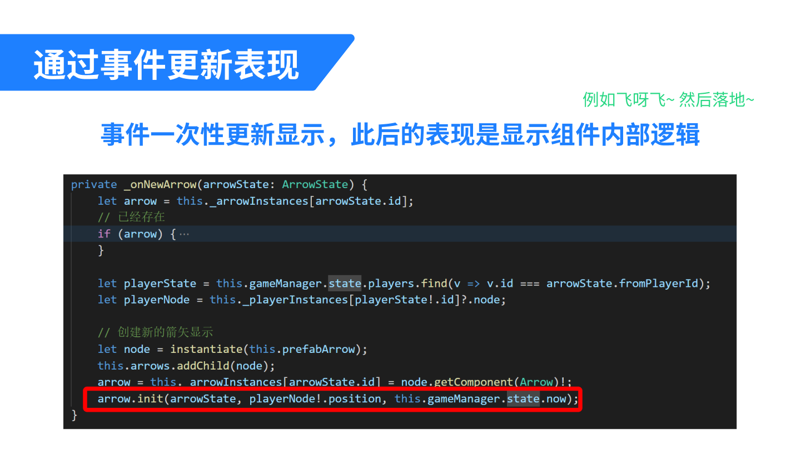

至此，所有工作都完成了~
TSRPC + Cocos，多人实时对战是不是 So Easy 呢？
快来体验一下吧~


Demo 体验地址：
- https://tsrpc.cn/fight/index.html

Demo 源码地址：<br/>
- https://github.com/k8w/tsrpc-examples/tree/main/examples/cocos-creator-multiplayer
- https://store.cocos.com/app/detail/3432

## 额外内容：处理延迟

对于多人实时游戏的体验，通常玩家最在意的就是 “延迟”，而这个延迟常被指向 “网络延迟”。
对它的理解，我们其实存在一些误区。

### 延迟不影响操作

从上面的几个例子中，我们可以得出几个重要的结论：

- 在无冲突时，网络延迟并 **不会** 影响操作延迟，预测+和解能实现本地 **零延迟** 的操作体验
- 发生冲突时，本地状态立即重设到最新状态，画面跳变，只有此时玩家能明显感受到 **“卡了”**
- **网络延迟影响的是冲突概率**：网络延迟越大，发生冲突的可能性越大

当使用了预测 + 和解之后，我们之前认为的 “网络延迟越大操作延迟越大”，就变成了一个 **误解** 。

即便是一个 MOBA 游戏，你在打野，另外一名玩家在刷兵线 —— 你们之间不存在 “冲突” 的可能性。此时即便网络有很大延迟，你们各自的游戏体验也应该都是单机游戏般 **零延迟** 的！
只有当你们在打团战时，才可能出现因为网络延迟导致技能判定等冲突；也只有当冲突出现时，你们才能直观感受到延迟的存在。

### 延迟越小越好吗

服务端可以在收到客户端输入后立即广播出去，也可以通过 LockStep 的方式固定同步频率。除了网络之外，同步频率也会影响延迟。比如服务端逻辑帧率每秒同步 10 次，那么意味着即便局域网内也可能出现 100ms 的延迟。

但网络延迟真的越低越好吗？
其实，**延迟小也有一个副作用**：插值不平滑。

假设你用 1 秒时间从 A 点匀速移动到 B 点，如果同步频率恰好是每秒 1 次，那么通过插值，其它玩家看到的应该是一个完全匀速的移动过程。
但如果同步频率是每秒 60 次呢？理论上每 16ms 你就会收到一个新状态，然后每 16ms 就要更新一次插值动画。但就跟延迟一样，**网络抖动也是客观存在的** 。你大概率不是均匀的每 16ms 收到一次消息，而是很可能时而 200ms 才收到一条消息，时而 20ms 内就收到 N 条消息。如此，其它玩家看到的移动过程将是忽快忽慢的，这种不平滑的动画会带来直观的卡顿感。

所以，延迟并非越小越好，这也是一个权衡利弊的过程：

- **延迟大** ：插值更平滑，冲突概率更大
- **延迟小** ：插值不平滑，冲突概率更小

延迟和同步频率在多少是最好的呢？这个没有标准答案，应该根据实际玩法需要权衡利弊后决定。

### 有延迟下的判定

在有延迟的情况下，技能命中的判定，该听谁的呢？来看一个简单的例子。

:::note 场景举例
在一片空地上，你拿起狙击枪瞄准一个正在移动的敌人头部。点下鼠标，一发弹道闪过 —— 你很确定，命中了！然而，由于网络延迟的存在，你看到的敌人，实际上是 200ms 以前的位置。在服务端的视角看来，你开枪的时刻敌人已经走远 —— 你打空了。那么此时，应当如何判定呢？我们分别来看看。
:::

假设我们选择以 **服务端** 的判定为准，那么你会很不爽。因为在你看来，明明打中了，敌人却没掉血，那对面肯定是开挂了。理论上，对面会很爽，因为服务端保护了他免于受伤。但事实上他没什么可开心的，因为他完全不知道服务端为他做了什么，他只会觉得 “对面真菜” 。

那如果我们选择以 **客户端** 的判定为准呢？当然你会很爽，因为判定结果和你的预期一致，你觉得这个游戏丝滑流畅没延迟，爽爆了。理论上对面会不爽，因为从服务端视角来看，其实你没打中他。但事实上他并不知道实际上发生了什么，他只会觉得是你枪法不错，打中了他。虽然被打中了，但对于他而言，游戏体验是流畅和符合预期的，没什么不爽。

所以看起来听客户端的大家都开心，那么是不是这样就万无一失了呢？也存在例外。

假如对面不是在空地上跑，而是躲进了一堵墙后面。此时他认为自己是安全的，但由于网络延迟，你这边依旧判定打中了他。此时在墙后的他仍然受到了伤害，他肯定很不爽，要么是网卡了要么是你开了穿墙挂。所以并没有 100% 完美的解决方案，权衡利弊后，如果你觉得出现这种情况的概率比较小可以接受，那么可以选择以客户端判定为准从而带来更好的游戏体验。

:::tip
你也可以在客户端发送输入时带上游戏时间，由服务端根据实际延迟来决定由谁判定。比如延迟在 200ms 以内时由客户端判定，否则由服务端判定。
:::

### 作弊的担忧

上面提到，为了更好的游戏体验，在某些情况下判定结果可由客户端决定。
这会带来作弊和外挂的风险吗？

先说结论，**不会** 。

首先，为了防作弊，你必须要做 **传输加密**。
如果你使用 JSON 这样的明文来传输，那不管你用什么样的方式，即便是有服务端验证，作弊也轻而易举，不是吗？
所以防作弊的前提是，传输层是加密的，起码有一定的破解门槛。

在传输层加密不被破解的基础上，客户端判定和服务端判定安全风险相差并不大，只是需要在体验层面权衡利弊选择更适合的方案。因为如前所说，玩法逻辑在前后端是通用的，而客户端亦可自由向服务端发送任何输入。
所以是客户端计算判定结果发送给服务端，还是客户端发送输入、由服务端完成计算，其过程都是一样的。你担心客户端可能发给你作弊的计算结果，其实客户端一样可能发给你作弊的输入。所以根源在于传输加密，而非服务端判定就万事大吉。

（正文完）

:::note 感谢你阅读到这里
欢迎关注公众号/B站/知乎/掘金：**TypeScript全栈开发**，持续了解最新 TSRPC 动态。
:::