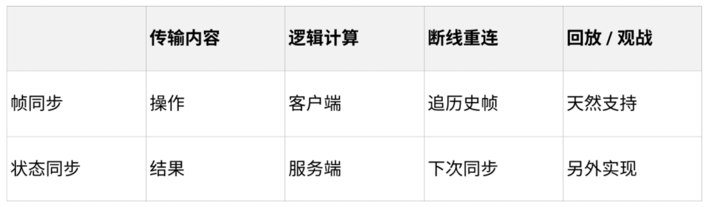

# TSRPC + Cocos，多人实时对战 So Easy！

## 写在前面

多人实时对战一直是游戏开发领域的一块硬骨头。听起来不简单，做好了更难。
但时代在进步，技术在发展。就像 Cocos Creator 让游戏开发变得更简单了一样，
基于最新的技术栈和理解，多人实时对战的门槛也一直在降低。

2021 年 12 月 4 日，有幸作为嘉宾参加了深圳站的 Cocos Star Meeting 线下交流会，
就 “多人实时对战” 这个领域结合历经 5 年沉淀的开源框架 TSRPC 进行了一些分享。

以下是本次分享内容的文字实录。

## 自我介绍

大家好，首先简单自我介绍一下。我是 **King 王忠阳**，Github ID 是 k8w。

曾经是腾讯互娱的一名老鹅，也是一枚老全栈。
2016 年时发现了 TypeScript，开始用它进行全栈开发，之后就真香得一发不可收拾。
2017 年，[TSRPC](https://tsrpc.cn) 1.0 第一次出现在了 Github 上。历经 5 年的沉淀发展，如今已进入 3.x 版本。

现在我的主要时间精力投入在开源项目 TSRPC 的开发和维护上，也提供一些技术咨询服务。欢迎大家关注我的公众号 / 知乎专栏 / 掘金 —— **TypeScript全栈开发** 。

## 目录

那么接下来进入今天的主题 —— TSRPC + Cocos，多人实时对战 So Easy！

我将主要分为 3 个部分介绍：

- **同步策略**
    - 介绍在有网络延迟的情况下，优化实时对战体验的方法
- **网络通信**
    - 细数网络通信的痛点，并介绍终极解决方案 —— TSRPC
- **项目实战**
    - 从零开始实现一个疯狂打群架多人版，看看是不是 So Easy

## 同步策略

说起 “多人实时对战” 首先就会想到 “同步”，那么说起 “同步” 你又最先想到什么呢？

### 帧同步 vs 状态同步？

没错，很多人会想到 **帧同步** 和 **状态同步**。
有关它们，你可以搜索到大量的介绍。
但首先，我想更正大家一个常见的误区。

很多时候我们都在讨论 “该用帧同步还是状态同步”，似乎这已经变成了一个非此即彼、二选一的问题。
但事实上，帧同步和状态同步不但 **不是** 二选一的关系，甚至可以 **相互替代** 和 **混合使用**。

因为，**帧同步和状态同步最终都是同步状态。**

假设我们要实现一堆人在一个房间里跑，无论你用状态同步 —— 直接发送你的坐标，或是帧同步 —— 发送移动操作再由客户端计算出最终坐标，对于表现层组件而言，需要的都是你的最终状态 —— 位置坐标。
所以实际上帧同步和状态同步更多讨论的是，网络传输什么，状态在哪里计算 —— 看起来更像一个成本问题。

只需确保你的状态计算逻辑在前后端都可运行，那么帧同步或状态同步就是可以并用或随时切换的。

### 同步状态

> 帧同步和状态同步都是同步状态。

首先来看看最简单、没有任何优化策略下，状态是怎么被同步的。

1. 本地按下按键，发出操作指令。
2. 指令发送给服务器，服务器得到最新状态，并广播给所有人。
3. 前端收到服务器的发送来的新状态后，刷新界面显示。

效果如图。（上面是自己的视角，中间是服务器，下面是其它玩家视角）

很明显，有几个问题：
1. 操作延迟
    - 由于网络延迟，按下左/右按键后，总要过一会才能收到服务器的返回，导致操作延迟，体验很差
2. 卡顿
    - 由于服务器同步的逻辑帧率（每秒 3 次）慢于显示帧率（每秒 60 帧），导致位移一卡一卡的，不流畅

但网络延迟一定客观存在，同步帧率和显示帧率也未必一致。所以我们需要一种办法，能够在有延迟、有卡顿的情况下，还能实现感觉不到延迟、并且丝滑流畅的体验。这就是同步的魔术 —— 同步策略。

### 同步策略

网络延迟是客观存在的，所以同步策略本质上是一种魔术，要在有延迟的情况下实现没有延迟的错觉。根据项目，主要有几种类型。

首先根据同步节奏分为快慢两种。

#### 慢节奏

同步间隔在 1~2 秒甚至更久，例如打牌、下棋等。
这种情况非常简单，只需在表现层面优化，做到 **即时反馈** 即可。
例如五子棋，当玩家点下鼠标按钮时，无需等到服务器返回才显示落子，而是立即显示落子，并发出 “啪” 的一声清脆的回响，给玩家一个即时的操作反馈。
可能实际上服务器延迟了 1 秒，但玩家是毫无感知的。

#### 快节奏

同步间隔较短，例如要实现咱们在一屋子里乱跑。那么这个也分情况，无冲突和有冲突的。

如果我们都是幽灵，那么就是无冲突的。因为我们的身体是虚无的，可以互相穿透。你的位置只受你自己控制，任何其它因素都影响不了，这个就叫无冲突。
那这个实现方案就非常简单 —— 你自己和其它人区别对待。你自己就实现为一个单机游戏，无论做了任何移动操作，都立即应用到表现层，只是将这些信息同步发送给服务端。其它人呢，就是收到服务端的信息，然后把它们的变化当动画一样播放出来就可以。当然，因为网络延迟的关系，你看到的可能是其它人 5 秒、10 秒前的状态了。可是那有什么关系呢？在幽灵这个无冲突的设定下，不会有任何影响，反而所有人都获得了单机游戏般丝滑流畅无延迟的体验，大家都很开心。

但另一种情况则不同，如果我们都是血肉之躯，会发生实际的物理碰撞，我站在这里你就不可能再站在相同的位置。这种情况就称为有冲突。**快节奏有冲突** 的同步策略会相对复杂一些，接下来着重介绍。

## 快节奏有冲突的同步策略

解决快节奏有冲突的同步策略，核心就是 3 个关键词：**预测、和解、插值** 。
理解了这 3 个概念，任何情况的同步对你来说应该都是游刃有余。
不过在此之前，让我们先看看逻辑与表现分离的架构。

### 逻辑与表现分离

多人实时游戏，通常会划分为表现层和逻辑层。
表现层指游戏画面的显示和用户输入的获取；
逻辑层指渲染无关的、只关注状态变化和计算的玩法逻辑。

逻辑层和表现层最终是面向数据的，例如玩家的位置、生命值等，我们把这些数据统称为 **状态**。
我们把所有能影响状态变化的因素称为 **输入**，例如玩家操作（如移动）、系统事件（如天上打雷了）、时间流逝等等。

逻辑层就是定义所有状态和输入，然后实现状态变更的算法：

**新状态 = 老状态 + 输入1 + ... + 输入N**

<!-- TODO 图 -->

:::info 重要
逻辑层本质上就是一个状态机。
:::

在实现逻辑层的过程中，有几个重要的点需要关注：

- **无输入，不变化**：状态变更仅发生在输入时刻，没有输入时状态不会改变
- **无外部依赖**：状态计算应该没有任何外部依赖，例如 `Date.now()`、`Math.random()` 等，所有这些都应该显式成为输入的一部分
- **结果的一致性**：在相同的状态和输入下，得到的新状态应该是一致的

::tip
例如随机数这类场景，可以通过伪随机数生成器实现，在相同的种子下，随机结果应该是一致的
:::

在逻辑层的状态计算基础之上，预测、和解、插值就更容易理解了。

### 预测

**预测就是将玩家的输入立即应用到本地状态，而无需等待服务端返回。**

如果玩家的每一次操作如果都要等到服务端确认后才能生效，那么延迟将是不可避免的。
解决方案就是：玩家做出任何操作后，立刻将输入应用到本地状态，并刷新表现层显示。
例如按下了 “右”，那么就立即向右移动，而无需等待服务端返回，效果如图。

<!-- TODO 图 -->

现在，操作的延迟消失了。你按下 “左” 或者 “右” 都可以得到立刻的反馈。

但问题似乎并没有完全解决，在移动过程中，你总是能感到来回的 “拉扯” 或者位置抖动。
这是因为你在执行本地预测的时候，也在接收来自服务端的同步，而服务端发来的状态总是滞后的。

例如：
1. 你的坐标是 `(0,0)`
1. 你发出了 2 个 `右移` 指令（每次向右移动 1 个单位），服务器尚未返回，执行本地预测后，**坐标变为 `(2,0)`**
1. 你又发出了 2 个 `右移` 指令，服务器尚未返回，执行本地预测后，**坐标变为 `(4,0)`**
1. 服务端发回了你的前 2 个右移指令：从 `(0,0)` 执行 2 次右移，**坐标变为 `(2,0)`**

由于延迟的存在，服务端的同步总是滞后的，所以你总是被拉回之前的位置。如此往复，就是你在图中看到的抖动和拉扯。

归根到底，是服务端同步过来的状态与本地预测的状态发生了冲突，所以我们需要 “和解” 它们。

### 和解

#### 公式

和解就是一个简单的公式：

**预测状态 = 权威状态 + 预测输入**

:::info 重要
和解的概念最难理解，但也是实现无延迟感体验最重要的一步。你可以先简单记住上面的公式，应用到项目中试试看。
:::

一般我们认为服务器总是权威的，从服务端接收到的输入称为 **权威输入**，经权威输入计算出来的状态称为 **权威状态**。
同样的，当我们发出一个输入，但尚未得到服务端的返回确认时，这个输入称为非权威输入，也叫 **预测输入**。

在网络畅通的情况下，预测输入迟早会变成权威输入。我们需要知道发出去的输入，哪些已经经过服务器同步变成了权威输入，哪些还是预测输入。在可靠的传输协议下（例如 WebSocket）你无需关注丢包和包序问题，所以只需通过简单的消息序号即可做到。

在前述预测的基础上，和解就是我们处理服务端同步的状态的方式。如果使用的是状态同步，那么这个过程是：

1. 收到服务端同步来的**权威状态**
1. 将本地状态立即设为此权威状态
1. 在权威状态的基础上，应用当前所有预测输入

如果使用的是帧同步，那么这个过程是：

1. 收到服务端同步来的**权威输入**
1. 将本地状态立即回滚至上一次的权威状态
1. 将权威输入应用到当前状态，得到此次同步的**权威状态**
1. 在权威状态的基础上，应用当前所有预测输入

由此可见，状态同步和帧同步只是网络传输的内容不同，但它们是完全可以相互替代的 —— 目的都是为了同步权威状态。

#### 例子

这有用吗？我们回看一下上面预测的例子，有了和解之后，会变成怎样：

1. 你的坐标是 `(0,0)`
1. 你发出了 2 个 `右移` 指令（每次向右移动 1 个单位），服务器尚未返回
    - 权威状态：`(0,0)`
    - 预测输入：`右移#1` `右移#2`
    - 预测状态：`(2,0)` （权威状态 + 预测输入）
1. 你又发出了 2 个 `右移` 指令，服务器尚未返回
    - 权威状态：`(0,0)` （未收到服务端同步，不变）
    - 预测输入：`右移#1` `右移#2` `右移#3` `右移#4`
    - 预测状态：`(4,0)` （权威状态 + 预测输入）
1. 服务端发回了你的前 2 个右移指令 （帧同步）
    - 上一次的权威状态：`(0,0)`
    - 权威输入：`右移#1` `右移#2`
    - 权威状态：`(2,0)` （上一次的权威状态 + 权威输入）
    - 预测输入：`右移#3` `右移#4` （#1、#2 变成了权威输入）
    - 预测状态：`(4,0)` （权威状态 + 预测输入）

看，虽然服务端同步来的权威状态是 “过去” 的，但有了和解之后，拉扯问题解决了。

<!-- TODO -->

预测 + 和解处理本地输入是非常通用的方式。你会发现，在没有冲突时，网络延迟几乎完全不会影响操作延迟。
例如上面移动的例子，如果不发生冲突（例如与它人碰撞），即便网络延迟有 10 秒，你也可以毫无延迟并且平滑的移动。
这就是在有延迟的情况下，还能实现无延迟体验的魔术。

#### 冲突

那么冲突的情况会怎样呢？比如上面的例子，你发送了 4 次移动指令，但在服务端，第 2 次移动指令之后，服务端插入了一个新输入 —— “你被人一板砖拍晕了”。这意味着，你的后两次右移指令将不会生效（因为你晕了）。
那么该过程会变成这样：

1. 你的坐标是 `(0,0)`
1. 你发出了 2 个 `右移` 指令（每次向右移动 1 个单位），服务器尚未返回
    - 权威状态：`(0,0)`
    - 预测输入：`右移#1` `右移#2`
    - 预测状态：`(2,0)`
1. 你又发出了 2 个 `右移` 指令，服务器尚未返回
    - 权威状态：`(0,0)`
    - 预测输入：`右移#1` `右移#2` `右移#3` `右移#4`
    - 预测状态：`(4,0)`
1. 服务端发回了你的前 2 个右移指令
    - 权威状态：`(2,0)`
    - 预测输入：`右移#3` `右移#4`
    - 预测状态：`(4,0)`
1. 服务端发回了与预期冲突的新输入
    - 上一次的权威状态：`(2,0)`
    - 权威输入：`你被拍晕了` `右移#3` `右移#4`
    - 权威状态：`(2,0)` （因为先被拍晕了，所以后两个右移指令无效）
    - 预测输入：无
    - 预测状态：`(2,0)`

此时，之前的预测状态 `(4,0)` 与最新的预测状态 `(2,0)` 发生了冲突，客户端当然是以最新状态为主，所以你的位置被拉回了 `(2,0)` 并表现为晕眩。这就是网络延迟的代价 —— 冲突概率。

### 插值

### 处理延迟

#### 对延迟的误解

对于多人实时游戏的体验，通常玩家在意的就是 “延迟”，而这个延迟常被指向 “网络延迟”。
那么，**网络延迟真的越低越好吗？**

首先，从上面的例子中，我们可以得出几个重要的结论：

- 在无冲突时，网络延迟并 **不会** 影响操作延迟，预测+和解能实现 **零延迟** 的体验
- 发生冲突时，本地状态立即重设到最新状态，画面跳变，只有此时玩家能明显感受到 **“卡了”**
- 网络延迟越大，发生冲突的可能性越大

所以，当使用了预测 + 和解之后，我们习惯性认为的 “网络延迟大操作就会卡”，显然是一个 **误解** 。

即便是一个 MOBA 游戏，你在打野，另外一名玩家在刷兵线，你们之间不存在 “冲突” 的可能性。即便网络有很大延迟，你们各自的游戏体验也应该都是 **零延迟** 的！
只有当你们在打团战时，才可能出现网络延迟导致的冲突（比如技能命中的判定），也只有当冲突出现时，你们才能感受到网络延迟。

#### 延迟补偿

技能命中听谁的？

## 网络通信

## TSRPC

## 项目实战