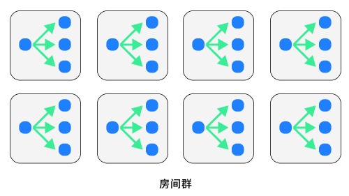

# 如何实现十万人在线的房间和匹配系统？文末有福利

<!-- - 上期回顾
    - TSRPC 状态同步、帧同步
    - 同步策略
    - 问题：分房间，能撑多少用户 -->

去年年底，在 [《TSRPC + Cocos，多人实时对战 So Easy！》](cocos-mutiplayer.html) 中我们分享了如何使用 TSRPC + Cocos 开发多人实时对战游戏，收到不少开发者的反馈。很多朋友都在问，[上次的案例](https://tsrpc.cn/fight/) 怎么才能改成支持多房间的，性能怎么样，能支持多少用户同时在线等等。

3 月底，腾讯云发布公告 [MGOBE 将于 2022 年 6 月 1 日正式下线](https://cloud.tencent.com/document/product/1038/71494)，也给不少开发者带来一些困扰。没有了 MGOBE，还有哪些替代方案？

本篇文章，将在 [上次的分享](cocos-mutiplayer.html) 基础上介绍，如何利用 TSRPC 实现 MGOBE 同款的房间系统和匹配系统，并利用分布式架构轻松支持十万人同时在线。

## 需求

首先来看看我们的需求：

- 房间系统：支持开房间，同时进行多局游戏
- 匹配系统：支持随机匹配，单排、组队匹配
- 全区全服：用户不需要选择服务器，用户感知就只有一个服务器
- 水平扩展：用户规模增长时，通过加机器即可完成扩容
- 平滑扩容：扩容时对运行中的服务不影响，不需要重启和停机

这里我们已经实现好了一个 Demo：
https://tsrpc.cn/room-management/

在 Demo 中我们可以创建房间和随机匹配，你会发现会自动在多个房间服务间自动切换，但用户没有感知。


:::tip
如果你需要这个 Demo 的源码，文末有福利哦~
:::

接下来看看实现思路，首先我们需要对分布式架构有一个基础了解。

## 分布式基础

### 负载均衡

#### 部署多份

NodeJS 是单线程的，所以通常，一个服务 = 一个进程 = 一个线程。
单线程服务的可用资源是有限的，最多只能利用 1 个 CPU 核心，随着用户规模的增长，很快就不够用了。
同时，单点部署也满足不了高可用的协议。
怎么办呢？

答案其实很简单：**多部署几份就可以了！**

你可以在同一台机器多启动几个进程（更好的利用多核 CPU 的性能），也可以分散在多台服务器部署。
如此，你就拥有多个相同的服务了，例如：

- http://10.0.0.1:3001
- http://10.0.0.1:3002
- http://10.0.0.2:3001
- http://10.0.0.2:3002

下一步，你需要将客户端的请求分发到各个服务上去，这件事被我们称为 **负载均衡**。

#### 分发策略
如同字面意思一样，负载均衡的目的就是要让你的多台服务器，在 CPU、内存、网络等使用率方面，达到相对均衡的状态。
例如你有 2 台服务器，A 服务器 CPU 90%+，B 服务器 CPU 20%，这肯定不是我们想要的结果。

理想情况下，当客户端的请求来了，肯定是看看所有服务器谁的资源占用最少，就分发给谁。
甚至于你可以实现的更精细一些，把 “负载” 的衡量指标精细到业务数据，例如 QPS、房间数量等。
但通常，简便起见，我们更多采用的是轮询或随机的方式来分发。对于大多数业务场景来说，这已经足够了，并且有很多现成的工具可以使用。
根据你的需求，丰俭由人。

#### 前置代理

分发连接和请求，本质上就是一个代理服务，有很多现成的工具就可以实现，例如：

- PM2
- Nginx
- 阿里云 SLB
- Kubernetes

如果你只是在单服务器上部署多个进程，那么 [PM2](https://pm2.keymetrics.io/) 就是一个绝佳的工具。

```shell
npm i -g pm2
# -i 启动的进程数，max 代表 CPU 核心数
pm2 start index.js -i max
```

像这样，就可以启动多份 index.js，启动份数等于你的 CPU 核心数。对于 NodeJS 单线程应用而言，进程数 = CPU 核心数有助于发挥最大性能。

使用 PM2 的好处是，你的多个进程，可以使用相同的端口而不会冲突。例如 10 个进程都监听 3000 端口，PM2 会作为前置代理对请求进行随机分发。

如果你是在多台服务器上部署，那么可以使用 Nginx 的 [upstream](https://www.nginx.cn/5130.html)；想省心的话，你也可以直接使用云厂商的负载均衡服务，例如 [阿里云的 SLB](https://www.aliyun.com/product/slb)。

:::tip
如果你需要使用 HTTPS，可以顺手在 Nginx 或 云厂商的负载均衡中配置 HTTPS 证书。
:::

当然，我们更推荐你学习使用 [Kubernetes](https://kubernetes.io/zh/docs/concepts/overview/what-is-kubernetes/)，它把服务发现的问题也解决了 —— 可以让你在扩缩容时，只需要点点加号和减号那样简单。Kubernetes 可以说是现阶段的通用 + 终极解决方案，目前主流云厂商都提供了 Kubernetes 的托管集群甚至 Serverless 集群，唯一不好的地方在于，它需要一定的学习成本。

#### 会话保持

通常我们把服务分为两类：无状态服务和有状态服务。

例如你把一个 HTTP API 服务部署了 2 份，由于它们只是对数据库的增删改查，请求连接哪个服务都一样。
换句话说，这次请求连服务器 A，下次请求连服务器 B，一点问题都没有。
这样的服务我们称为无状态的。

另一种情况则不然，比如你部署了 10 个王者荣耀的房间服务，你连进服务器 A 在某房间进行游戏，突然网络断线了。那么此时断线重连后，你肯定还是需要连接到服务器 A，因为你玩到一半的游戏房间、你的队友（都是状态），都在服务器 A 呢！这种服务，我们称为有状态的。

显然，对于有状态服务，会有一个通用的需求：即上次连接到了哪个服务器，下次还要继续保持。这个特性，通常被我们称为 “会话保持”。

实现会话保持略微有一些麻烦，Nginx 和 云厂商的负载均衡都有类似功能支持，但是确实是没那么方便。
我们在实践过程中，还有另一种更轻量的做法，在下文的具体方案中会介绍。

负载均衡的部分就先到这里，总结一下就是如何把一个服务部署多份来实现水平扩展和高可用。

### 拆分服务

接下来介绍拆分服务，即如何把一个大服务拆成多个不同的小服务。

#### 为什么要拆分

对于一个应用而言，我们往往会拆成好几个服务（例如现在流行的微服务架构），这到底是为什么呢？

这其中，有开发时刻的考量，例如方便团队的分工协作和项目模块解耦，把一个有 200 个接口的大项目，拆成 5 个各有 40 个接口的小项目。

同时，也有运行时刻的考量，例如不同模块的资源需求不同，可以部署 100 个实时游戏房间服务但只部署 5 个匹配服务，来实现资源的精细规划管理。

#### 怎么拆分

首先，根据你的业务、组织结构，运行时的资源规划考量，设计好你要拆分出哪几个服务。
然后，有两种方式可以选择：

- 拆分为不同的独立项目
- 在同一项目下拆分入口点

一般来说，项目跟项目之间不是完全独立的。会有相当一部分代码可以共用，例如数据库表结构定义、登录态鉴权逻辑、公共业务逻辑等等。

如果你选择了拆分为不同的项目，那么你就需要考虑如何在不同项目间共享代码，例如：

- 通过 Git Submodules 共享
- 通过 NPM 共享
- 通过 MonoRepo 的方式共享
- 通过 Git 流水线，自动将代码分发到多个项目

当然，无论上述哪个方式都会引入额外的学习和维护成本。如果你的情况允许，我们更推荐你 **在同一项目下拆分项目**。

1. 首先根据不同项目拆分协议和 API 目录
    
2. 将原入口点 `index.ts` 拆分为多个
3. 开发时，独立运行各个服务，有两种方式可选：
    - 拆分为多个 `tsrpc.config.ts`，在 `npx tsrpc-cli dev --config xxx.config.ts` 时指定
    - 只保留单个 `tsrpc.config.ts`，通过 `entry` 参数指定启动入口：`npx tsrpc-cli dev --entry src/xxx.ts`

在同一项目下拆分服务，有几点好处：

1. 天然跨项目复用代码，没有额外的学习和维护成本
2. 运维部署成本更低，你只需要构建一份程序或容器镜像，即可完成各个服务的部署（只是修改启动入口点就可以了）

### 动态配置

最后，你可以通过环境变量来控制运行时的动态配置（例如运行端口号等），以实现多份服务的灵活部署。

```ts
// 通过环境变量 PORT 来控制配置
const port = parseInt(process.env['PORT'] || '3000');
```

运行时设置环境变量，在 Windows 和 Linux 下命令不同，此时可以借助跨平台的 `cross-env`：
```shell
npm i -g cross-env
cross-env FIRST_ENV=one SECOND_ENV=two npx tsrpc-cli dev --entry src/xxx.ts
cross-env FIRST_ENV=one SECOND_ENV=two node xxx.js
```

如果你使用 PM2，也可以借助其 `ecosystem.config.js` 来完成配置：
```js title=ecosystem.config.js
module.exports = {
  apps : [
    {
      name      : 'AAA',
      script    : 'a.js',
      env: {
        PORT: '3000',
        FIRST_ENV: 'One',
        SECOND_ENV: 'Two'
      }
    },
    // More...
  ]
};
```

```shell
# 启动
pm2 start ecosystem.config.js
```

## 核心架构

### 项目结构

在同一项目下拆分为以下服务：

- 房间服务：WebSocket 服务，用于游戏房间内逻辑，为有状态服务
- 匹配服务：HTTP 服务，用于创建房间、随机匹配，视为无状态服务（下文详细说明）

房间本质上就是一堆 Connection 的聚合，将房间封装成 Class，管理好 Connection 的加入/退出，处理它们的消息收发逻辑即可。

匹配，本质上就是将匹配队列里的信息按一定的规则组合，然后返回这个结果。所以匹配操作，就是一次请求响应 —— 请求时将当前用户加入匹配队列，然后在定期运行的匹配逻辑中返回响应。因此用 HTTP 短连接就够了，当然，你可以将超时时间设置长一些。

### 全区全服分布式架构

#### 房间组

通常，房间服务需要的服务器资源更多，匹配服务需要的服务器资源较少。
因此匹配服务与房间服务设计为 **一对多** 的关系，即由 1 个匹配服务来管理多个房间服务的房间创建和匹配，以此视为一个 **房间组**。


根据实际需要，你可以部署 1 个或多个房间组，就形成了一个分布式的房间群。



#### 不设接入层服务

房间群，是不是看着有点像网游里的大区？但由于我们的需求是全区全服，所以不能让用户感知到选服。
经典全区全服的三层标准结构，是这样的：


在接入层中统一完成鉴权，代理转发，会话保持等操作。显然，接入层服务非常重要，它的开发和维护也存在一定复杂性。

但是，如果我们使用的是 WebSocket，并且选择的是在同一项目下拆分服务，那么这套架构可以 **大幅简化**！我们可以直接 **不设接入层服务**。


由于是在同一项目下，各个服务共享鉴权等接入层逻辑，是件很容易的事。例如用户登录后生成了一个登录凭据，用它作为访问各个服务的凭据即可。
可参考：[登录态和鉴权](/docs/flow/access.html)

由于没有接入层，所以也就不存在代理转发，不同的服务直接通过不同的 URL 直连即可。
对于无状态服务，通过负载均衡的前置代理，多份部署可以对外暴露为同一个 URL。
有状态服务，由于会话保持的需要，将它们暴露为不同的 URL 即可。

如此，我们既节省了复杂的接入层开发，还减少了中间代理的延迟损耗。

### 服务间 RPC

根据上述架构，匹配服务需要知道它旗下的所有房间的实时状态，来完成匹配逻辑。
这就需要匹配服务和房间服务之间相互有 RPC 通信。别忘了，TSRPC 是跨平台的，利用 TSRPC 的 NodeJS 版客户端即可完美实现。

由于我们的需求是平滑扩容，即增加服务部署时不需要重启现有服务，因此我们需要自行实现一个简单的服务注册机制，本方案的实现是这样的：


1. 房间服务启动前，需要通过配置指定其归属的匹配服务 URL。你可以指定为上面提到的无状态服务的统一 URL，这样就会在所有匹配服务中随机选择一个。或者你想实现更精细的控制，那就额外给每个匹配服务单独绑定一个 URL，然后根据你的规则去自行制定。
1. 房间服务启动后，主动到匹配服务注册，然后二者建立 WebSocket 长连接，开启 RPC 通信。
2. 房间服务定期向匹配服务同步实时的房间状态信息。
3. 匹配服务通过 RPC 调用房间服务的 `CreateRoom` 等接口完成房间管理事项。

由于房间服务是一个服务一个 URL，所以启动之后，你需要更新前置代理（如 Nginx 或 Kubernetes Ingress）的配置，绑定对应 URL 到当前服务。
这个过程，当然也可以通过程序来自动完成~ （没有提供，可自行实现或手动修改）

## 效果验证

### 开房间

开房间的完整请求过程如下：

1. 客户端向匹配服务发起 `创建房间` 请求
2. 匹配服务从其 RPC 着的 N 个房间服务中，选择一个（比如房间数最少的那个），通过 RPC 创建房间，拿到房间 ID
3. 向客户端返回房间 ID 和对应房间服务的 URL 地址
4. 客户端直连房间服务，加入房间
5. 客户端邀请其它好友加入，向他们发送 `房间服务 URL` + `房间 ID`
6. 其它好友同样直连房间服务加入游戏

可见，即便存在多个房间组，也不会影响玩家之间的开房互通。

### 随机匹配

随机匹配的完整请求过程如下：

1. 客户端向匹配服务发起 `随机匹配` 请求
2. 匹配服务将该连接加入匹配队列
3. 匹配服务定期执行匹配，根据实时房间信息，选择用户适合的房间，返回 `房间服务 URL` + `房间 ID`
4. 客户端通过 `房间服务 URL` + `房间 ID` 直连房间服务并加入房间

可能有朋友会问，如果存在多个房间组，那匹配时不是相当于只和部分玩家在一起匹配，并不是真的所有玩家匹配呀？

事实上，当你已经需要用到多个房间组的时候，说明你已经有相当的玩家基数了。
而匹配，其实真的不需要所有玩家一起匹配，一个房间组的内的用户数量，应该已经完全可以满足匹配的时间需要了。

特殊情况下，例如你需要将用户分群匹配，而非混在一个房间组里，那也可以将不同房间组绑定到几个不同的 URL 上，进行前置分流。
总而言之，所有接入层代理转发的活儿，交给 URL 即可。

### 水平扩展和平滑扩容

房间服务和匹配服务都可以水平扩展，并且它们都是支持平滑扩容的。

增加部署房间服务，只需要配置、启动房间服务，按照上述服务注册流程，匹配服务会自动将它纳入麾下，对现有服务没有任何影响。

增加部署匹配服务，就跟增加部署无状态服务一样，也是平滑无感知的。

所以，只要你的机器够多，其它依赖如数据库、Redis 撑得住，十万人同时在线也没有问题。

:::tip
闲聊一嘴，因为有不少朋友来问 TSRPC、本方案与 Pomelo 的区别。
Pomelo 是非常优秀的框架，凭借 NodeJS 实现了接入层、服务注册与发现、服务间 RPC 等诸多机制。但在今天，其实也有新的变化。

在集群管理方面，出现了 Kubernetes 这样标准化的方案，无论是扩缩容、服务注册与发现、URL 路由等等方面，都更专业、可靠、高性能。
云厂商的托管服务和中间件也日趋完善……

更精细的分工诞生了更专业的的工具，所以今天，不是所有工作都需要你亲自在 NodeJS 中完成。善用这些工具链，能让你把有限的精力更专注在业务上，事半功倍。
:::

## 福利

Demo 体验地址：https://tsrpc.cn/room-management/index.html

包含前后端的完整工程如有需要可以去 Cocos Store 获取。

传送门：https://store.cocos.com/app/detail/3766

附上 7 天内有效的限时优惠福利：


也欢迎扫码加入 TSRPC 和 TypeScript 全栈开发微信交流群：

