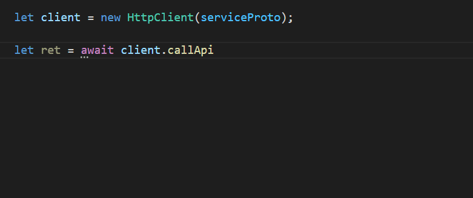

# 实现 API 接口

在这一节中，我们将体验使用 TSRPC 快速实现一个 API 接口，并在浏览器中调用它。

本节内容的完整例子在：https://github.com/k8w/tsrpc-examples/tree/main/examples/first-api

## 初始化项目

我们先初始化一个 Web 全栈项目：
```shell
npx create-tsrpc-app@latest first-api --presets browser
# 或者
yarn create tsrpc-app first-api --presets browser
```

如你所见，创建好的项目中已经自带了一个简单应用和几个接口，运行 `npm run dev` 启动本地服务试试看吧。

## 概念

使用 TSRPC 开发 API 接口前，必须先了解几个重要的概念。
- **API 接口**
    - API 接口就相当于一个实现在远端的异步函数
    - 这个函数的输入参数叫做 **请求（Request）**，返回值叫做 **响应（Response）**
- **协议（Protocol）**
    - API 接口的类型定义，包括它的请求类型和响应类型
- **实现函数（Implementation）**
    - API 接口的功能实现，接收请求并返回响应
- **服务端（Server）**
    - API 接口的实现端，NodeJS 12 以上
- **客户端（Client）**
    - API 接口的调用端，支持多个平台，如浏览器、小程序前端，或是 NodeJS 后端微服务调用

实现一个 API 接口，只需要 3 个步骤：
**定义协议 -> 服务端实现 -> 客户端调用**。

## 定义协议

1 个接口对应 1 个协议文件，TSRPC 按照命名来识别，规则如下：

- 协议文件命名为 `Ptl{接口名}.ts`，统一放置在 **协议目录** 下
    - 协议目录默认 `backend/src/shared/protocols`，允许子目录嵌套
- 协议包含请求类型 `Req{接口名}` 及响应类型 `Res{接口名}`
    - 通过 TypeScript 的 `interface` 或 `type` 定义
- API 接口的实际请求路径为 `{协议路径}/{接口名}`
    - 协议路径：协议文件于协议目录的相对路径

例如我们想要定义一个请求路径为 `user/Login` 的接口，则：
1. 在协议目录下创建子目录 `user`，在其中创建文件 `PtlLogin.ts`
1. 定义请求类型 `ReqLogin`
1. 定义响应类型 `ResLogin`

```ts title="backend/src/shared/protocols/user/PtlLogin.ts"
// 请求
export interface ReqLogin {
    username: string,
    password: string
}

// 响应
export interface ResLogin {
    user: {
        id: number,
        nickname: string
    }
}
```

:::tip
创建协议文件前，建议总是先运行 `npm run dev` 启动本地开发服务。
这使得开发期间，协议文件变更时会自动生成和同步相关代码，提高开发效率。
:::

## 服务端实现

1 个接口对应 1 个实现函数文件，TSRPC 按照命名来识别，规则如下：

- 实现函数文件命名为 `Api{接口名}.ts`，统一放置在 **实现目录** 下
    - 实现目录默认 `backend/src/api`
- 实现文件中包含名为 `Api{接口名}` 的异步函数

后端 `npm run dev` 运行期间，当你创建新的协议文件后，会自动生成对应的实现文件。
实现与协议具有相同的子目录结构：

```
|- backend/src
    |- shared/protocols <协议目录>
        |- user
            |- PtlLogin.ts   协议定义
    |- api              <实现目录>
        |- user
            |- ApiLogin.ts   接口实现
```

- 实现函数中，通过参数 `call: ApiCall` 来处理请求和响应
    - 通过 `call.req` 来获取请求参数，即协议中定义的 `ReqLogin`，框架会确保此处类型**一定合法**（非法请求被自动拦截）
    - 通过 `call.succ(res)` 来返回响应，即协议中定义的 `ResLogin`
    - 通过 `call.error('错误消息', { ...错误参数 })` 来返回错误


例如上面的 `user/Login` 接口，对应的实现函数文件如下：

```ts title="backend/src/api/user/ApiLogin.ts"
import { ApiCall } from "tsrpc";

export async function ApiLogin(call: ApiCall<ReqLogin, ResLogin>) {
    // 错误
    if(!(call.req.username === 'admin' && call.req.password === 'admin')){
      call.error('用户名或密码错误');
      return;
    }

    // 成功
    call.succ({
        user: {
          id: 123,
          nickname: 'Test'
        }
    })
}
```

## 客户端调用

### 使用 TSRPC 客户端

使用现成的 TSRPC 客户端，你无需关注 HTTP 请求细节，只需像调用本地异步函数那样调用远端接口，并且享有完整的代码提示和类型检查：

<!-- TODO 换图 user/Login -->
<!-- 代码提示、类型检测二合一 -->


使用的方式很简单：
1. 根据不同的平台，从 NPM [安装客户端](../client/install.html)
2. 创建 `HttpClient` 实例，它支持多请求并发，所以你可以只创建一个并全局共享
3. 通过 `callApi` 方法，向本地异步函数一样调用远端 API

例如调用上面的 `user/Login` 接口，你可以：

```ts
import { HttpClient } from 'tsrpc-browser';
import { serviceProto } from './shared/protocols/serviceProto';

// 创建 HttpClient 实例
let client = new HttpClient(serviceProto, {
    server: 'http://127.0.0.1:3000',
    json: true
});

async function login(){
    // 调用接口
    let ret = await client.callApi('user/Login', {
        username: 'admin',
        password: 'admin'
    })

    // 处理错误
    if(!ret.isSucc){
        console.log('登录失败', ret.err.message);
        return;
    }

    // 成功
    console.log('登录成功', ret.res.user);
}
```

`callApi` 方法的返回如下：

- 根据请求成功与否，返回两种结果：
    - 成功：`{ isSucc: true, res: 协议定义的响应格式 }`
    - 失败：`{ isSucc: false, err: TsrpcError 对象 }`
- 无论任何情况都 **不会抛出异常**
    - 因此无需对 `callApi` 进行 `catch` 捕获异常
    - 只需统一处理返回的 `err` （包含网络错误、业务错误、代码异常等）


### 手动发送请求

当然，你也可以手动发送 HTTP 请求，规则如下：
- 统一使用 `POST` 方法
- URL 为 `协议路径` + `接口名`
- 需要 Header `Content-type: application/json`，请求 body 为 JSON 字符串

例如上面的 `user/Login` 接口，请求 URL 为 `http://127.0.0.1:3000/user/Login`，完整请求如下：

```http
POST /user/Login HTTP/1.1
Host: 127.0.0.1:3000
Content-Type: application/json

{
    "username": "admin",
    "password": "admin"
}
```

:::tip
除非必要，不推荐手动发送请求，更推荐使用 TSRPC 客户端 —— 代码提示和类型检查能有效提升开发效率。
:::

## 小结

TSRPC 将 API 的实现和调用流程大幅简化，使跨端 API 调用就像本地异步函数一样简单，
只需关注接口本身的输入和输出，
而不需要去关注 Method、URL、Header、Body 这样的底层 HTTP 传输细节。

相比文档和第三方语言，直接使用 TypeScript 类型定义接口也优势显著，前后端开发都可以全程享受代码提示和运行时类型安全。
如果你需要，也可以 [一键生成接口文档](../server/advanced/api-doc.html)，支持 Swagger / OpenAPI / Markdown 格式。

更不可思议的是，你甚至可以直接传输 `ArrayBuffer`、`Date`、`ObjectId` 等 JSON 无法支持的数据类型！
这些都得益于独一无二的 [TSRPC 类型系统](type-system.html)。