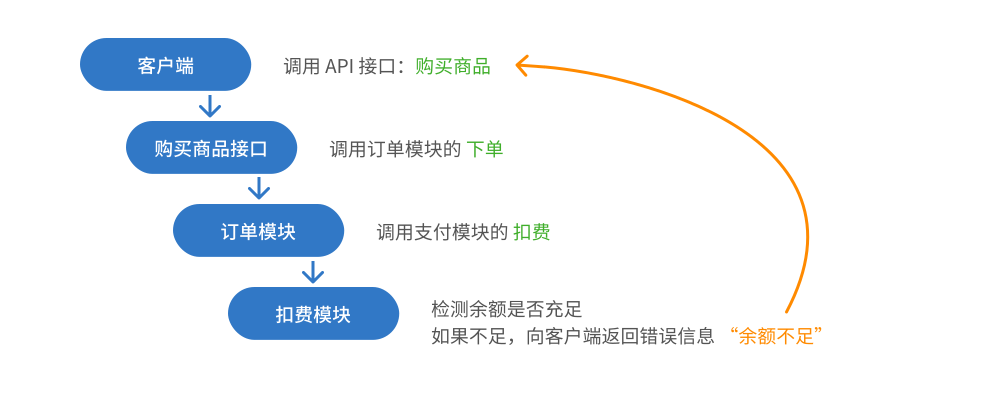

# API 接口服务

## API Service 是什么
API Service 是基于 **请求 / 响应** 模型的服务，即从客户端获取请求参数，经服务端处理后返回响应。
响应是必须的，无论服务端是否正确收到和处理请求，客户端都将收到明确的回复，含成功和错误两种情况。
这一过程在服务端被实现为一个异步函数。

定义一个 API 接口参见 [这里](service-proto.html#api-service) 。

## 实现 API

### 实现函数

一个 API Service 的实现即是一个异步函数，一个空白的 API 实现函数。

- 1 个接口对应 1 个实现文件，命名为 `Api{接口名}.ts`，位于 API 实现目录下，默认是 `backend/src/api`。
- 实现函数有一个参数 `call: ApiCall<ReqXXX, ResXXX>`，我们通过该参数来获取请求参数和返回响应。

模板如下：

```ts
import { ApiCall } from 'tsrpc';

export async function ApiXXX(call: ApiCall<ReqXXX, ResXXX>) {

}
```


### 请求和响应

- 通过 `call.req` 来获取请求参数，即协议中定义的 `Req{接口名}`，框架会确保请求类型 **一定合法**（非法请求被自动拦截）
- 通过 `call.succ(res)` 来返回成功响应，即协议中定义的 `Res{接口名}`
- 通过 `call.error('错误消息', { ...错误参数 })` 来返回错误
    - 第 1 个参数为可读的错误信息，例如 “余额不足”、“密码错误” 等
    - 第 2 个参数选填，为错误的额外信息，可以传入任意字段（例如错误码、错误类型）

定义响应类型只需考虑成功的情况，TSRPC 提供统一范式来处理所有类型的错误。欲了解更多，请参考 [错误处理](../engineering/error.html#TsrpcError) 。

### 注意事项
`call.succ()` 和 `call.error()` 是两个函数调用，**不等于** `return`，实现函数将继续向后执行。

例如这是一个 “购买商品” 接口：
```ts
export async function ApiBuy(call: ApiCall<ReqBuy, ResBuy>) {
    if(余额不足){
        call.error('余额不足了哟~');
        // return;
    }

    发货();
    call.succ({
        result: '购买成功'
    })
}
```

假设命中了 “余额不足”，执行了 `call.error` 返回错误。
但由于在这之后没有 `return`，所以代码还是会继续向后执行，一路 `发货()` 直到 `call.succ`。
虽然余额不足，但是却发货了。

**所以，请谨记：**

在 `call.error` 或 `call.succ` 后，如果这不是最后一行代码，但流程到此结束，务必记得 `return`。

### 打印日志
在一个 API 实现函数中，你应该使用 `call.logger` 来打印日志，而非 `console`。

```ts
call.logger.log('xxxxx');
```

这是因为，一个 `Server` 总是并行处理多个请求，如此多个请求的日志就会被合并在一起，你很难区分。
`call.logger` 会给日志信息自动增加一些前缀，例如连接 ID、请求 ID，这让你在调试时，能更方便的筛选同一条请求的日志。


如果你希望修改这些前缀，例如在一个前置的 [Flow](../flow/flow.html) 中解析了登录态，希望在每一条请求日志的前缀中，都增加已登录的用户 ID。
可以通过 `call.logger.prefixs` 来修改，例如：
```ts
call.logger.prefixs.push('UserID=123456');
```

## 挂载到 Server

实现一个 API 接口后，需要将其挂载到 `Server` 方能对外提供服务，这里有两种方法可以实现。

### 自动挂载

如果你是使用 `npx create-tsrpc-app@latest` 创建的项目，默认是采用这种形式。
在 `backend/src/index.ts` 中可以看到这样一行代码：

```ts
await server.autoImplementApi(path.resolve(__dirname, 'api'));
```

`server.autoImplementApi` 即是将目标文件夹中的 API 实现自动挂载，规则是：
- 遍历协议目录下所有 `PtlXXX.ts` 文件，在实现目录下，查找对应的文件 `ApiXXX.ts`
    - 例如 `protocols/a/b/c/PtlXXX.ts` 对应 `api/a/b/c/ApiXXX.ts`
- 在该文件下，查找与 `ApiXXX` 同名的导出函数，将该函数作为接口实现对外提供服务
- 如果在该文件下找不到 `ApiXXX` 的同名函数，则使用该文件的默认导出 `default` 作为实现函数
- 如果指定 `autoImplementApi` 的第 2 个参数为 `true`，则开启延迟挂载，即延迟到对应接口被调用时才执行挂载操作，加快冷启动速度

### 手动挂载

除自动挂载外，也可以手动挂载，例如：

```ts
server.implementApi('user/Login', call => {
    // API 实现部分
});
```

:::info 重要
建议将所有 API 实现函数都挂载好，再调用 `server.start()` 启动服务。
:::

## 拆分代码

随着项目规模的增长，一个 API 接口的实现代码不太可能全部都在一个文件内完成。
同时，我们可能还会有多个接口复用同一段业务逻辑代码的需要。
总而言之，我们需要拆分代码，然后在 API 接口中调用他们。

那么问题来了，如果不在 API 实现函数内，要怎么处理上面提到的分级日志和错误响应呢？

### 将 `logger` 作为参数传递
将 `logger: Logger` 作为一个参数传递给外部的公共函数，即可方便的实现多 API 复用情况下的分级日志处理。

```ts
export static class SomeUtil {
    static someFunc(logger?: Logger){
        logger?.log('xxxx');
    }
}
```

:::note
这并不会影响它在非 TSRPC 项目的兼容性，毕竟你总是能传递 `console` 作为一个合法的 `Logger`。
:::

### 抛出 `TsrpcError`
设想一下你在开发一个 “购买商品” 的 API 接口，业务流程是这样的：



可以看到，当你将业务逻辑拆分，然后经过层层调用后，最终有一个错误信息要返回给顶层的调用端。
实际业务中的链路可能比这更长！通常我们可能是按这 2 种方式处理：

1. 将错误信息层层返回，然后在 API 实现的每个调用处去做错误检测，发现业务错误则 `call.error`。
    - **问题：**非常繁琐，会显著增加代码量；你在每个地方都必须检测错误，忘记一处就可能引发问题。
2. 将 `call` 层层向后传递，在实际错误发生处拿传递来的 `call` 去 `call.error`。
    - **问题：**非常不优雅，相当于将单纯的业务逻辑和 TSRPC 框架耦合在了一起，不便于它们的跨项目使用。

**TSRPC 给出了一种新的解决方式：`throw new TsrpcError()`** 

```ts
import { TsrpcError } from 'tsrpc';

export class 扣费模块 {
    扣费(logger?: Logger){
        if(余额不够){
            throw new TsrpcError('余额不足', {
                code: 'NOT_ENOUGH_MONEY'
            })
        }
    }
}
```

TSRPC 约定，API 接口实现函数执行过程中如果遇到异常：
- 如果抛出的错误是 `TsrpcError`，则视为是**可以直接返回给客户端的错误**，会自动通过 `call.error` 返回给客户端。
- 如果不是，则视为服务端内部错误，会返回一个 `type` 为 `ServerError` 的错误给客户端，错误信息默认为 `"Server Internal Error"`。

因此，在业务代码被拆分至 API 实现函数以外时，`throw new TsrpcError` 是一种无视调用层级向客户端直接返回错误的简便方式。