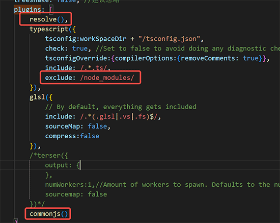

# 安装

## 通过脚手架创建项目

你可以通过脚手架工具 [create-tsrpc-app](../get-started/create-tsrpc-app.html) 快速创建全栈项目。

```shell
npx create-tsrpc-app@latest
# 或者
yarn create tsrpc-app
```

或者，你也可以根据本节内容，手动安装和配置项目。

## 手动安装

TSRPC 客户端支持许多平台，根据目标平台选择对应的 NPM 包安装。

|         客户端平台          |    NPM 包     |
| :-------------------------: | :-----------: |
|    浏览器、React Native     | tsrpc-browser |
| 小程序（微信、抖音、QQ 等） | tsrpc-miniapp |
| NodeJS（如后端微服务互调）  |     tsrpc     |

例如目标平台是浏览器，则安装 `tsrpc-browser`：

```shell
npm install tsrpc-browser
# 或者
yarn add tsrpc-browser
```

## 创建客户端

无论安装哪个平台的客户端 SDK，其 API 都是一致的：

- HTTP 客户端使用 `HttpClient`
- WebSocket 客户端使用 `WsClient`
- 客户端支持并发请求，所以你可以只创建一个，全局共享

`HttpClient` 和 `WsClient` 的构造函数均有 2 个参数。

- 第 1 个参数 `serviceProto`，可从 `src/shared/protocols/serviceProto.ts` 中引入，是 [自动生成](../server/service-proto.html#生成方式) 的。
- 第 2 个参数为客户端配置，可配置选项参见：[HttpClientOptions](/api/http-client#httpclientoptions)、[WsClientOptions](/api/ws-client#wsclientoptions)

### HTTP 客户端

```ts
import { HttpClient } from 'tsrpc-browser';
import { serviceProto } from './shared/protocols/serviceProto';

// 创建全局唯一的 apiClient，需要时从该文件引入
export const apiClient = new HttpClient(serviceProto, {
  server: 'https://xxx.com/api',
  json: true,
});
```

### WebSocket 客户端

WebSocket 客户端需要手动连接后方可使用：

```ts
import { WsClient } from 'tsrpc-browser';
import { serviceProto } from './shared/protocols/serviceProto';

// 创建客户端
export const client = new WsClient(serviceProto, {
  server: 'wss://xxx.com/api',
  json: true,
});

// 连接
client.connect().then((res) => {
  // 连接不一定成功（例如网络错误），所以要记得错误处理
  if (!res.isSucc) {
    console.log(res.errMsg);
  }
});
```

## 跨平台使用

例如你在使用 [uni-app](https://uniapp.dcloud.io/) 或 [Taro](https://taro.aotu.io/) 这样的跨平台前端框架实现一个需要同时支持多端（例如浏览器 + 微信小程序 + Android App + iOS App）的应用。
那么你需要根据实际运行的平台，来选择对应的客户端库。
由于 TSRPC 的 API 在不同平台的库之间是 **重名** 的，所以你需要在 `import` 时手动 `as` 为一个 **别名**，例如：

```ts
import { HttpClient as HttpClientBrowser } from 'tsrpc-browser';
import { HttpClient as HttpClientMiniapp } from 'tsrpc-miniapp';
import { serviceProto } from './shared/protocols/serviceProto';

// 根据实际运行平台创建对应的 Client
export const client = 是微信小程序
  ? // 微信小程序使用 tsrpc-miniapp
    new HttpClientMiniapp(serviceProto, {
      server: 'https://xxx.com/api',
      json: true,
    })
  : // 浏览器和原生环境使用 tsrpc-browser (XMLHttpRequest 兼容的环境都可以使用 tsrpc-browser)
    new HttpClientBrowser(serviceProto, {
      server: 'https://xxx.com/api',
      json: true,
    });
```

## 在 Cocos Creator 中使用

目前 Cocos Creator 2.x 和 3.x 各版本都是完美支持的。

由于 Cocos Creator 天然就是 NPM 支持良好，所以无需额外配置，参照上述例子 `npm install` 安装和 `import` 使用即可。
如果你的项目是跨平台的，那么也需要像上面的例子那样，根据运行平台来创建对应的客户端。

## 在 Laya 2.x 中使用

Laya 默认不支持引用 NPM，你只需稍稍做一些修改即可使 Laya 支持 NPM，方法如下。

在命令行中执行：

```shell
npm i rollup-plugin-node-resolve rollup-plugin-commonjs -D
```

修改 `.laya/compile.js`，加入：

```js
const resolve = require('rollup-plugin-node-resolve');
const commonjs = require('rollup-plugin-commonjs');
```

搜索 `plugins` 部分，修改以下 3 处：



之后，直接按上述方式，`npm install` 和 `import` 使用 TSRPC 客户端即可。

## 在 Laya 3.x 中使用

1. 在 Laya 项目根目录下 `npm init` 创建 `package.json`
2. 在 Laya 项目根目录下 `npm install tsrpc-browser`
3. 修改 Laya 项目根目录的 `tsconfig.json`，在 `compilerOptions` 中增加 `"moduleResolution": "node"`

然后就可以向其它平台一样，使用 TSRPC 了：

```ts
import { WsClient } from 'tsrpc-browser';

let client = new WsClient(serviceProto, {
  server: 'ws://127.0.0.1:3000',
});
```
