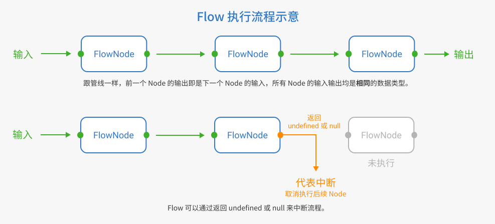
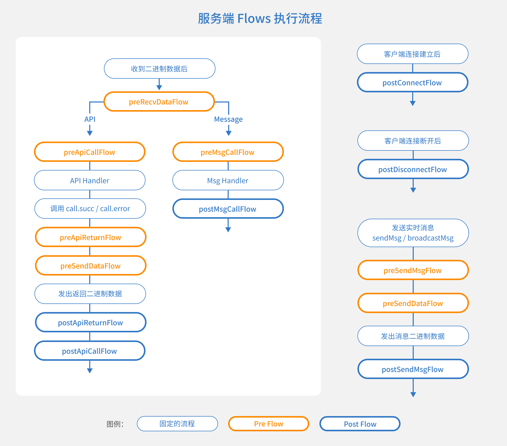

# Flow

## Flow 是什么？

任何一种框架，想要适应更多的业务场景，就离不开良好的可扩展性。
`Flow` 就是 TSRPC 为此设计的一种全新概念。

`Flow` 与管线和中间件类似，它由一组输入输出类型都相同的函数组成，同步或异步皆可。
我们把其中的每个函数称为 `FlowNode`。
与管线有一点区别的是，`FlowNode` 可以返回 `null | undefined` 来代表**中断流程**。



每一个 `Flow` 和都有一个固定的数据类型 `<T>`，即它节点函数的输入和输出类型，定义如下：

```ts title="FlowNode 定义"
export type FlowNodeReturn<T> = T | null | undefined;
export type FlowNode<T> = (item: T) => FlowNodeReturn<T> | Promise<FlowNodeReturn<T>>;
```

`Flow` 就像一个 `FlowNode` 的数组，你可以通过 `flow.push(flowNode)` 来追加一个新节点。
`Flow` 在执行时，将从第一个 `FlowNode` 开始执行（参数为原始输入参数），然后将上一个 `FlowNode` 的输出作为下一个 `FlowNode` 的输入，逐个执行；直到得到最后的输出或收到 `null | undefined` 而提前中断。

接下来就来看一下 `Flow` 在 TSRPC 中的具体使用方式。

## TSRPC 工作流

TSRPC 为整个通讯过程制定了统一的工作流。
在此基础之上，将工作流中的一些节点，通过 `Flow` 曝露出来供开发者定制。`Flow` 在服务端和客户端是通用的，你可以使用同一套编程范式来扩展各端的行为。
例如在服务端，你可以在下图任何一个 Flow 的地方进行控制，来实现诸如传输加密、身份验证等定制流程。



想要控制工作流，向这些 `Flow` 中 `push` 你自己的 `FlowNode` 函数即可，例如一个实现简单的登录验证：

```ts
server.flows.preApiCallFlow.push(call => {
    if(isLogined(call.req.token)){    // 假设你有一个 isLogined 方法来检测登录态 token 是否合法
        return call;    // 正常返回，代表流程继续
    }
    else{
        call.error('您还未登录');
        return null;    // 返回 null 或 undefined，代表流程中断
    }
});
```

### Pre Flow 和 Post Flow
根据名称前缀，TSRPC 内置的 `Flow` 分为两类，`Pre Flow` 和 `Post Flow`。当它们的 `FlowNode` 中途返回了 `null | undefined` 时，都会中断 `Flow` 后续节点的执行。但对于 TSRPC 工作流的影响，有所区别：

- 所有 `Pre Flow` 的中断，**会**中断后续的 TSRPC 工作流，例如 Client `preCallApiFlow` 中断，则会阻止 `callApi`。
- 所有 `Post Flow` 的中断，**不会**中断后续的 TSRPC 工作流，例如 Server `postConnectFlow` 中断，**不会**阻止连接建立和后续的消息接收。


### 服务端 Flows

通过 `server.flows` 获取，例如：
```ts
server.flows.preApiCallFlow.push(call=>{
    // ...
})
```

| 名称 | 作用 |
| - | - |
| postConnectFlow | 客户端连接后 |
| postDisconnectFlow | 客户端断开连接后 |
| preRecvDataFlow | 处理收到的数据前 |
| preSendDataFlow | 发送数据前 |
| preApiCallFlow | 执行 API 接口实现之前 |
| preApiReturnFlow | API 接口返回结果（`call.succ`、`call.error`）之前 |
| postApiReturnFlow | API 接口返回结果（`call.succ`、`call.error`）之后 |
| postApiCallFlow | 执行 API 接口实现之后 |
| preMsgCallFlow | 触发 Message 监听事件之前 |
| postMsgCallFlow | 触发 Message 监听事件之后 |
| preSendMsgFlow | 发送 Message 之前 |
| postSendMsgFlow | 发送 Message 之后 |

### 客户端 Flows

通过 `client.flows` 获取，例如：
```ts
client.flows.preCallApiFlow.push(v=>{
    // ...
})
```

| 名称 | 作用 |
| - | - |
| preCallApiFlow | 执行 `callApi` 之前 |
| preApiReturnFlow | 将 `callApi` 的结果返回给调用方之前 |
| postApiReturnFlow | 将 `callApi` 的结果返回给调用方之后 |
| preSendMsgFlow | 执行 `sendMsg` 之前 |
| postSendMsgFlow | 执行 `sendMsg` 之后 |
| preSendDataFlow | 向服务端发送任何数据之前 |
| preRecvDataFlow | 处理服务端发来的任何数据之前 |
| preConnectFlow | 连接到服务端之前（仅 WebSocket） |
| postConnectFlow | 连接到服务端之后（仅 WebSocket） |
| postDisconnectFlow | 从服务端断开连接之后（仅 WebSocket） |

## 类型扩展

如上面所见，很多 `Flow` 中伴随着 `Connection` 或 `Call` 的传递。
在这个过程中，我们可能会希望给它们增加一些额外的数据。
例如：
- 给 `call` 增加一个 `call.currentUser`，用于向后传递从登录态解析出来的用户信息
- 给 `conn` 增加一个 `conn.connectedTime` 来记录连接建立时间

TSRPC 本身不包含这些字段，直接使用它们会报错，所以需要先对 TSRPC 的已有类型进行扩展。
TSRPC 支持以如下的方式进行类型扩展：

### 直接扩展 `tsrpc` 库的类型

在 `declare module 'tsrpc'` 中直接扩展现有的类型：

```ts
declare module 'tsrpc' {
    export interface BaseConnection {
        // 自定义的新字段
        connectedTime: number;
    }

    export interface ApiCall {
        currentUser: {
            userId: string,
            nickname: string
        }
    }
}
```

之后，你在使用这些类型时，上述自定义的字段已经合法。
在任何地方使用它们都是类型正确的，例如：

- **在 Flow 中**
```ts
server.flows.postConnectFlow.push(conn => {
    conn.connectedTime = Date.now();
});

server.flows.preApiCallFlow.push(call => {
    call.currentUser = {
        userId: 'xxx',
        nickname: 'xxx'
    }
})
```

- **在 API 实现中**
```ts
export async function ApiXXX(call: ApiCall<ReqXXX, ResXXX>){
    // call.currentUser 变成合法字段
    call.logger.log(call.currentUser.nickname);
}
```

但如果你希望在一个程序中启动两个不同的 `Server`，它们各自扩展不同的字段，例如：
- `server1` 仅增加 `call.currentUser`
- `server2` 仅增加 `call.loginedUser`

那么直接扩展 `tsrpc` 库的类型就可能导致混用的可能，此时就需要通过创建新类型的方式实现扩展。

### 创建新类型

创建新的 `Connection` 和 `Call` 的类型，同时兼容已有的类型定义：

```ts
type MyConnection = WebSocketConnection & {
    connectedTime: number
}

type MyCall<Req=any, Res=any> = ApiCall<Req, Res> & {
    currentUser: {
        userId: string,
        nickname: string
    }
}
```

然后在需要使用的地方，手动替换为自己的类型：

- 在 API 实现中
```ts
export async function ApiXXX(call: MyCall<ReqXXX, ResXXX>){
    // call.currentUser 变成合法字段
    call.logger.log(call.currentUser.nickname);
}
```

- 在 Flow 中
```ts
server.flows.preApiCallFlow.push((conn: MyConnection) => {
    conn.connectedTime = Date.now();
});

server.flows.preApiCallFlow.push((call: MyCall) => {
    call.currentUser = {
        userId: 'xxx',
        nickname: 'xxx'
    }
})
```

## 例子
通过灵活的 `Flow`，开发者可以实现很多特性，我们整理了一些常见的场景：
- [实现 Session 和 Cookie 特性](./session-and-cookie.md)
- [用户登录和权限验证](./user-authentication.md)
- [基于二进制的传输加密](./transfer-encryption.md)
- [前端本地 Mock 测试](./mock.md)
- [GET 接口、静态页面等自定义 HTTP 响应](./custom-http-response.md)

<!-- - 触发事件：例如监听接收到 API 请求的事件，以便统计访问 QPS。
- 转换数据：例如在发送二进制数据前加密，接收数据前解密。
- 暂停继续：例如前端请求了一个需要登录的接口，则自动拉起登录弹框，登录成功后再继续发送请求。
- 中断流程：例如在检测到操作权限不足后，提前拦截 API 请求。 -->
