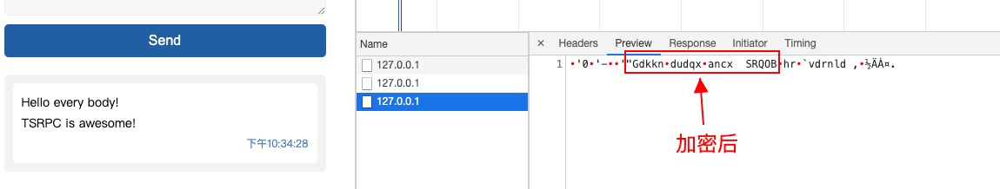

# 传输加密

## 思路

TSRPC 的传输是二进制的，因此加解密算法应当也是基于二进制（`Uint8Array`）的。
已经有很多成熟算法可以直接使用（如 `RC4`、`AES`、`RES` 等），当然你也可以实现自己的私有算法。

在服务端和客户端，均有 `preSendDataFlow` 和 `preRecvDataFlow` 可以让你在发送和接收二进制前做处理。
所以只需要在 `preSendDataFlow` 将 Buffer 加密，在 `preRecvDataFlow` 将 Buffer 解密，即可实现传输加密。

如果加解密逻辑在前后端相同，你也可以把这部分代码放在 `shared` 目录共享。
## 实现

### 加解密算法

我们来实现一个简单的加密算法：
- 加密：将二进制流中的每个字节都 `+1`
- 解密：将二进制流中的每个字节都 `-1`

:::note
在 `Uint8Array` 中，`0 - 1 === 255`，`255 + 1 === 0`，所以上述算法在边界条件下也生效。
:::

由于前后端都要进行同样的加解密操作，所以我们将这个算法放在 `shared` 目录下共享：

```ts title="shared/models/EncryptUtil"
export class EncryptUtil {

    // 加密
    static encrypt(buf: Uint8Array): Uint8Array {
        for (let i = 0; i < buf.length; ++i) {
            buf[i] -= 1;
        }
        return buf;
    }

    // 解密
    static decrypt(buf: Uint8Array): Uint8Array {
        for (let i = 0; i < buf.length; ++i) {
            buf[i] += 1;
        }
        return buf;
    }

}
```

### 使用 Flow 扩展工作流

加密算法实现好了，接下来使用 Flow 去扩展服务端和客户端，让它们在发送和接收二进制数据前，自动进行加解密操作。

#### 服务端

```ts
// 发送前加密
server.flows.preSendDataFlow.push(v => {
    if(v.data instanceof Uint8Array){
        v.data = EncryptUtil.encrypt(v.data);
    }
    return v;
});
// 接收前解密
server.flows.preRecvDataFlow.push(v => {
    if(v.data instanceof Uint8Array){
        v.data = EncryptUtil.decrypt(v.data);
    }    
    return v;
})
```

#### 客户端

```ts
// 发送前加密
client.flows.preSendDataFlow.push(v => {
    if(v.data instanceof Uint8Array){
        v.data = EncryptUtil.encrypt(v.data);
    }    
    return v;
});
// 接收前解密
client.flows.preRecvDataFlow.push(v => {
    if(v.data instanceof Uint8Array){
        v.data = EncryptUtil.decrypt(v.data);
    } 
    return v;
})
```

如此，传输过程就会自动使用 `EncryptUtil` 进行加解密了，打开浏览器就可以看到结果。

**加密前：**


**加密后：**


这个例子的加密算法实现的非常简单，你可以自行实现更复杂的算法，返回一个全新的 `Uint8Array` 甚至改变长度都是可以的。

## 完整例子

参见：https://github.com/k8w/tsrpc-examples/tree/main/examples/transfer-encryption