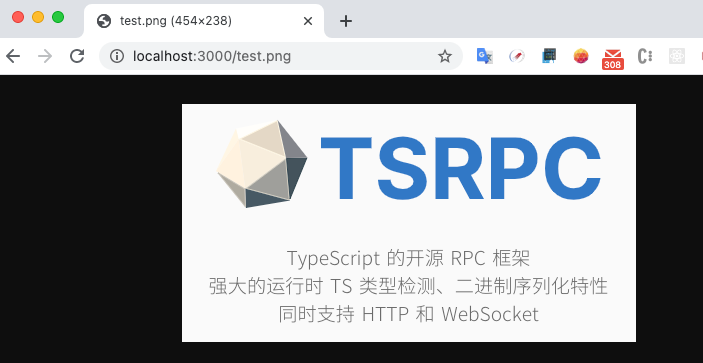

# 自定义 HTTP 响应

:::tip 注意
本节的内容仅适用于 `HttpServer`。
:::

使用 TSRPC，虽然有配套的客户端，不需要去考虑构建 HTTP 请求的细节。
但是有些时候，你可能会想要后端支持一些特定的普通请求。
例如服务器信息页，静态文件服务，或者一些简单的控制类 GET 接口之类。

通过 `Flow`，你也可以完成这些操作，甚至将 TSRPC 嫁接到其它框架上。

## 实现

在 `server.flows.preRecvDataFlow` 的节点函数中，有一个参数字段为 `conn`，
它即是实际传输协议的 `Connection`。
由于 TSRPC 实现为跨传输协议的，所以你直接取到的 `conn` 是 `BaseConnection` 类型。

如果你创建的是 `HttpServer`，则对应的 `conn` 实际是 `HttpConnection`。
此时，通过 `conn.httpReq` 和 `conn.httpEnd` 你可以获取到 NodeJS 原生 `http` 模块的 `req` 和 `res` 对象，然后就可以自由进行操作了。

如果你要返回自己的响应，则可以通过 `conn.httpRes` 去实现。
但记得在那之后 `return undefined` 来中断 Flow 和后续流程，
这样就不会进入到后面的二进制解码、API 解析等环节。

例如：
```ts
// Custom HTTP Reponse
server.flows.preRecvDataFlow.push(v => {
    let conn = v.conn as HttpConnection;

    if (conn.httpReq.method === 'GET') {
        conn.httpRes.end('Hello World');
        return undefined;
    }

    return v;
})
```

然后在浏览器里直接打开后端服务地址 `http://localhost:3000`，可以看到我们的自定义响应：


进一步的，你可以实现一个简单的文件服务：

```ts
// Custom HTTP Reponse
server.flows.preRecvDataFlow.push(async v => {
    let conn = v.conn as HttpConnection;

    if (conn.httpReq.method === 'GET') {
        // 静态文件服务
        if (conn.httpReq.url) {
            // 检测文件是否存在
            let resFilePath = path.join('res', conn.httpReq.url)
            let isExisted = await fs.access(resFilePath).then(() => true).catch(() => false);
            if (isExisted) {
                // 返回文件内容
                let content = await fs.readFile(resFilePath);
                conn.httpRes.end(content);
                return undefined;
            }
        }


        // 默认 GET 响应
        conn.httpRes.end('Hello World');
        return undefined;
    }

    return v;
})
```



## 完整例子

参见：https://github.com/k8w/tsrpc-examples/tree/main/examples/custom-http-res

:::tip
TSRPC 的 API 和 Message 通讯都是通过 `POST` 方法，所以确保你不会影响到它们。
:::