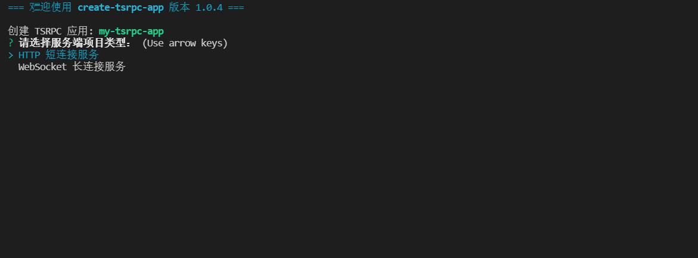

# 创建 TSRPC 应用

## 创建项目

使用 `create-tsrpc-app` 工具，可以快速创建 TSRPC 项目。

```shell
npx create-tsrpc-app@latest
```

创建过程是交互式的，在菜单上选择相应的配置，即可轻松创建包含前后端的 TSRPC 全栈应用项目。



:::note
需要 NodeJS 12 以上，可通过 `npx create-tsrpc-app@latest --help` 查看更多帮助信息。
:::

:::tip
记得不要忘记命令末尾的 `@latest`，这使你总是能从最新版本的项目模板创建。
:::

## 全栈项目结构

TSRPC 在前后端项目间共享协议定义等公共代码，来获得更好的代码提示和提高开发效率。
通常，服务端项目被命名为 `backend`，客户端项目被命名为 `frontend`，它们都有一个共享代码目录 `src/shared`。共享目录在后端编辑，然后只读同步到前端，也可以使用 Symlink 来自动同步。

常见的目录结构如下：
```
|- backend --------------------------- 后端项目
    |- src
        |- shared -------------------- 前后端共享代码（同步至前端）
            |- protocols ------------- 协议定义
        |- api ----------------------- API 实现
        index.ts

|- frontend -------------------------- 前端项目
    |- src
        |- shared -------------------- 前后端共享代码（只读）
            |- protocols
        |- index.ts
```

:::tip
`frontend` 和 `backend` 是两个完全独立的项目，可以放在同一个代码仓库中，也可以分散在两个独立的代码仓库。
:::

## 本地开发

前端和后端项目，均在各自的目录通过 `npm run dev` 运行本地开发服务。

```shell
cd backend
npm run dev
```

```shell
cd frontend
npm run dev
```

项目模板里已经自带了小例子，启动看看效果吧~

## 编译构建

同理，在各自的目录通过 `npm run build` 编译构建，默认输出到 `dist` 目录。
```shell
cd backend
npm run build
```

```shell
cd frontend
npm run build
```
