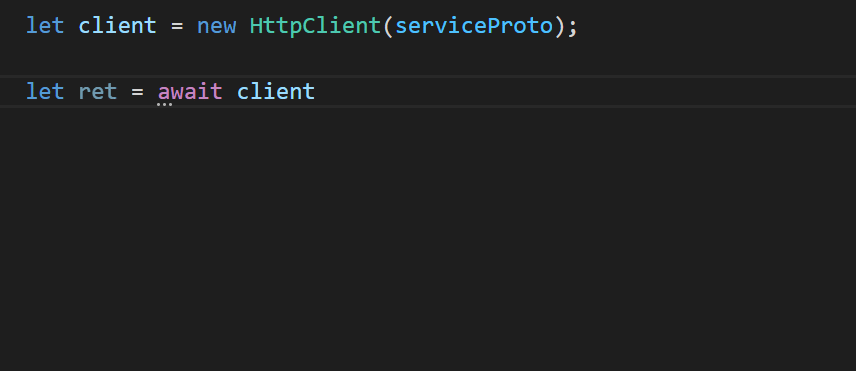

# 实现第一个 API

在这一节中，我们将体验使用 TSRPC 快速实现一个 API 服务，并在浏览器中调用它。

本节内容的完整例子在：https://github.com/k8w/tsrpc-examples/tree/main/examples/first-api

## 初始化项目

我们先初始化一个 Web 全栈项目：
```
npx create-tsrpc-app first-api --presets browser
```

然后删除自带的演示代码，即清空以下目录：
- `backend/src/shared/protocols`
- `backend/src/api`

## 概念

使用 TSRPC 开发 API 接口前，必须先了解几个重要的概念。
- **API**
    - API 接口就相当于一个实现在远端的异步函数，这个函数的输入参数叫做**请求（Request）**，返回值叫做**响应（Response）**。
- **协议（Protocol）**
    - 协议就是 API 接口的类型定义，包括它的请求类型和响应类型，也可以包含接口的其它配置信息（例如是否需要登录验证等）。
- **API 实现**
    - 实现指 API 接口的功能实现代码。
- **服务端（Server）**
    - API 接口的实现端，NodeJS 12 以上。
- **客户端（Client）**
    - API 接口的调用端，支持多个平台，例如：浏览器，APP，微信小程序，NodeJS等。

所以实现一个后端 API 接口，只需要 3 个步骤：
**定义协议 -> 服务端实现 -> 客户端调用**。

:::note
TSRPC 将 API 的协议和实现分开的原因在于：协议部分前后端都能用到，可以被跨项目共享；而实现显然只存在于 NodeJS 服务端。
:::

## 定义协议
### 编写协议文件
协议目录默认位于 `backend/src/shared/protocols` 目录下，协议文件的命名规则为 `Ptl{接口名}.ts`。

例如我们想要实现一个名为 `Hello` 的协议，则在该目录下创建文件 `PtlHello.ts`，然后分别定义请求类型 `ReqHello` 和 响应类型 `ResHello`，记得要加上 `export` 标记导出它们。

```ts
export interface ReqHello {
    name: string
}

export interface ResHello {
    reply: string,
    time: Date
}
```

:::tip
TSRPC 按照名称前缀来识别协议（Ptl）、请求（Req）、响应（Res），所以务必按照规定的方式命名。
:::

### 生成 ServiceProto
[`ServiceProto`](../development/service-proto.md) 是 TSRPC 运行时实际使用的协议格式，执行以下命令来自动生成：
```shell
cd backend
npm run proto
```

:::tip
每当协议修改后，都应该执行此命令重新生成。
:::

## 实现 API

### 创建实现文件
TSRPC 的 API 接口实现与协议定义是分离的，这是因为协议定义中包含着的类型信息，可以跨项目共享；而实现部分显然只能运行在 NodeJS 服务端。
为了区分，协议定义统一命名为 `Ptl{接口名}.ts`，接口实现统一使用前缀 `Api{接口名}.ts`。

接口实现位于 `backend/src/api`，与协议定义一一对应，文件名前缀由 `Ptl` 替换为 `Api`。我们已经帮你准备好自动生成的工具，只需在上一步后接着执行：
```shell
npm run api
```

如此，空白的 API 文件就自动生成了。对于我们刚刚定义的协议 `PtlHello.ts`，对应生成的实现文件名为 `ApiHello.ts`，目录结构如下：
```
|- backend/src
    |- shared/protocols
        |- PtlHello.ts   接口 Hello 的定义
    |- api
        |- ApiHello.ts   接口 Hello 的实现
    |- index.ts
```

:::tip
已经存在的 API 文件不会被覆盖或删除，可以随时增量生成。
:::

### 请求和响应
API 的实现就是一个异步函数，对客户端的输入输出是通过传入的参数 `call` 来实现的。
- 通过 `call.req` 来获取请求参数，即协议中定义的 `ReqHello`，框架会确保此处类型**一定合法**。
- 通过 `call.succ(res)` 来返回响应，即协议中定义的 `ResHello`。
- 通过 `call.error('可读的错误信息', { xxx: 'xxx' })` 来返回错误，第二个参数为想返回的额外字段，是选填的。

例如：

```ts title="backend/src/api/ApiHello.ts"
import { ApiCall } from "tsrpc";

export async function ApiHello(call: ApiCall<ReqHello, ResHello>) {
    if(call.req.name === 'World'){
        call.succ({
            reply: 'Hello, ' + call.req.name,
            time: new Date()
        });
    }
    else{
        call.error('Invalid name');
    }
}
```

## 调用 API

### 共享代码

要调用 API，客户端必须要有相同的协议定义文件，除此之外可能还有其它公共逻辑代码可以在前后端复用。
为此，我们设计了 `src/shared` 这个目录。该目录下的内容总是在 `backend` 中编辑，然后只读同步到 `frontend` 中。

执行以下命令，来完成同步：

```shell
cd backend
npm run sync
```

:::note
`shared` 目录在前端只读是为了防止前端的修改被后端的同步覆盖。如果你想在前端也能安全的修改 `shared` 目录下的内容，可以选择 `Symlink` 的自动同步方式。
:::

### 使用客户端

使用 TSRPC 客户端，即可像调用本地异步函数那样调用远端 API，并享有全过程的代码提示和类型检测。
它支持许多平台，根据需要从不同的 NPM 包 `import { HttpClient }` 即可，其余的写法全部一样。

| 客户端平台 | NPM 包 |
| :-: | :-: |
| 浏览器、React Native | tsrpc-browser |
| 微信小程序 | tsrpc-miniapp |
| NodeJS | tsrpc |

由于我们创建的是浏览器 Web 项目，所以引用的是来自 `tsrpc-browser` 的浏览器版客户端。
例如：

```ts title="frontend/src/index.ts"
import { HttpClient } from 'tsrpc-browser';
import { serviceProto } from './shared/protocols/serviceProto';

let client = new HttpClient(serviceProto, {
    server: 'http://127.0.0.1:3000',
    logger: console
});
```

:::note
设置 `logger: console` 可将 API 调用情况打印到控制台，便于调试。
这是因为 TSRPC 的传输是二进制序列化的，所以你在开发者工具的网络面板中看到的将是一团乱码。
你也可以在生产环境中省去这项配置，这样就没人知道你在干什么了😁。
:::

### callApi

不同平台的客户端用法几乎都是一致的：使用 `client.callApi()` 来调用远程 API，就像在本地调用一个异步函数一样。
TSRPC 对于前端接入的体验是极致的。全过程输入输出都有代码提示，甚至连 URL 都不需要记。完全不需要协议文档，也不必担心拼写错误带来的低级错误，从此可以告别前后端联调的痛苦体验。



:::note
`callApi` 的返回类型叫做 `ApiReturn`，所以常取名为 `ret`。
:::

### 处理错误和响应

`callApi` 不总是成功的，可能出现一些错误。
传统基于 `Promise` 或回调函数的方式存在一些隐患，这常常成为 BUG 的根源，例如：

#### 一、 分散地处理各种错误

例如如果你使用 `fetch`，通常有这些错误等着你处理：
```js
fetch(...)
    .then(v=>{ 
        1. HTTP 状态码报错
        2. HTTP 状态码正常，但返回了业务报错（例如 “余额不足” “密码错误”）
    })
    .catch(e=>{ 
        1. 网络错误
        2. 代码报错
    })
```

有非常多潜在的错误，它们分散在各个角落等着你处理。疏忽一处，就可能引发问题。

#### 二、 忘记处理错误

很多新手没有处理错误的意识，例如在上面的例子中，可能会忘记 `catch`。
这点小小的疏忽可能造成很大的问题，例如一个常见的需求：“请求期间显示 Loading”。
```js
showLoading();   // 显示一个全屏 Loading
let res = await fetch( ... );
hideLoading();   // 隐藏 Loading
```

乍一看没毛病，可一旦发生网络错误，`fetch` 会抛出异常，下面的 `hideLoading()` 不会执行。如此，界面上的 Loading 就永远不消失，通常被称为 “卡死了”。
不要小看它，实际项目中有相当比例 “卡死” 的问题跟这有关！

#### TSRPC 的解决之道

先看例子：
```ts title="frontend/src/index.ts"
window.onload = async function () {
    let ret = await client.callApi('Hello', {
        name: 'World'
    });

    // Error
    if (!ret.isSucc) {
        alert('Error: ' + ret.err.message);
        return;
    }

    // Success
    alert('Success: ' + ret.res.reply);
}
```

在 TSRPC 中：
1. 所有方法都 **不会抛出异常**
    - 因此总是 **无需** `catch()` 或 `try...catch...` ，规避了新手陷阱。
2. 所有错误都 **只需在一处处理**
    - 根据 `ret.isSucc` 判断成功与否，成功则取响应 `ret.res`，失败则取错误 `ret.err`（包含了错误类型和详情信息）。
2. 通过 TypeScript 类型系统，巧妙的使你 **必须做错误检测**
    - 如果你将上面错误处理部分的代码删去，或是删除处理错误后的 `return`，TypeScript 编译器会报错。

## 测试一下

在 `frontend` 和 `backend` 目录下分别执行以下命令，启动本地开发服务器：
```shell
npm run dev
```

服务启动后，用浏览器打开 http://127.0.0.1:8080 看看效果吧~

## 自动类型检测

TSRPC 自动对请求和响应进行类型检测，同时在编译时刻和运行时刻，同时在客户端和服务端。
因此在编写 API 实现时，完全不需要关心类型安全问题。

**例子：请求类型不合法，在编译时刻报错**
```ts
callApi('Hello', {
    name: 12345     // 类型错误
})
```

即便我们跳过了 TypeScript 的编译时刻检查，TSRPC 框架也会在运行时刻进行校验。
- 客户端先进行一次校验，将类型不合法的请求拦截在本地。
- 服务端在执行 API 前还会做二次校验，确保进入执行阶段的 API 请求一定是类型合法的。

**例子：请求类型不合法，被框架拦截**
```ts
callApi('Hello', {
    name: 12345
} as any);  // as any 跳过 TypeScript 编译时刻检查

// 请求被拦截，返回类型错误信息 {isSucc: false, err: ... }
console.log(ret);   
```

## 二进制序列化

在 Chrome 中打开开发者工具，进入 Network 面板抓包后可以发现，传输内容看起来像乱码一般，这是因为框架自动将传输内容序列化成了二进制编码。它比 JSON 有着更小的传输体积和更好的安全性。
仍然看见一些明文是因为 TSRPC 并未对包体进行加密或压缩，开发者可以自行完成二进制编码的加密和压缩，我们在[后面的章节](../flow/transfer-encryption.md)有所介绍。

## 向后兼容 Restful API
二进制序列化能获得更好的传输效能，但考虑到兼容性，TSRPC 也支持 XMLHttpRequest、fetch 等传统 JSON 方式的调用方法。

Server 端开启 `jsonEnabled` 选项：
```ts
const server = new HttpServer(serviceProto, {
    ...
    // 兼容 JSON 调用（POST）
    jsonEnabled: true,
    ...
});
```

浏览器端即可通过 JSON 调用：
```ts
fetch('http://127.0.0.1:3000/Hello', {
    method: 'POST',
    headers: {
        'Content-Type': 'application/json'
    },
    body: JSON.stringify({
        name: 'World'
    })
})
```

调用规则为：
- URL 为 `服务根路径/协议路径/接口名`
- Method 为 `POST`，body 为 JSON 字符串
- 需要包含 Header `Content-Type: application/json`

`jsonEnabled` 默认关闭，对安全性要求高的系统，不建议启用（提高协议破解门槛）。

:::tip
JSON 兼容模式，不影响自动类型检测正常工作，它不但会自动检测已定义的字段，还会将未定义的多余字段自动剔除，确保类型绝对安全。
:::