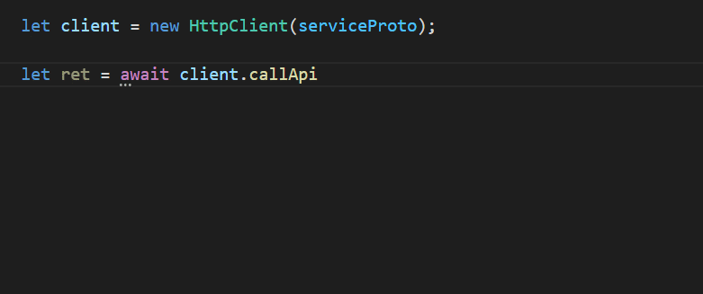

# 实现 API 接口

在这一节中，我们将体验使用 TSRPC 快速实现一个 API 接口，并在浏览器中调用它。

本节内容的完整例子在：https://github.com/k8w/tsrpc-examples/tree/main/examples/first-api

## 初始化项目

我们先初始化一个 Web 全栈项目：
```
npx create-tsrpc-app@latest first-api --presets browser
```

如你所见，创建好的项目中已经自带了一个简单应用和几个接口。
先运行 `npm run dev` 来启动本地服务。

## 概念

使用 TSRPC 开发 API 接口前，必须先了解几个重要的概念。
- **API 接口**
    - API 接口就相当于一个实现在远端的异步函数，这个函数的输入参数叫做**请求（Request）**，返回值叫做**响应（Response）**。
- **协议（Protocol）**
    - 协议就是 API 接口的类型定义，包括它的请求类型和响应类型，也可以包含接口的其它配置信息（例如接口需要的角色权限等）。
- **实现（Implementation）**
    - 通常就是一个异步方法，接受请求并返回响应，实现 API 接口的具体功能。
- **服务端（Server）**
    - API 接口的实现端，NodeJS 12 以上。
- **客户端（Client）**
    - API 接口的调用端，支持多个平台，例如：浏览器，APP，微信小程序，NodeJS等。

所以实现一个后端 API 接口，只需要 3 个步骤：
**定义协议 -> 服务端实现 -> 客户端调用**。

:::note
TSRPC 的协议和实现是分开在不同文件的，这样设计是因为：协议在前后端都能用到，可以跨项目共享；而实现函数显然只存在于 NodeJS 服务端。
:::

## 定义协议
<!-- ### 编写协议文件 -->
协议目录默认位于 `backend/src/shared/protocols` 目录下，协议文件的命名规则为 `Ptl{接口名}.ts`。

例如我们想要实现一个名为 `Hello` 的协议，则在该目录下创建文件 `PtlHello.ts`，然后分别定义请求类型 `ReqHello` 和 响应类型 `ResHello`，记得要加上 `export` 标记导出它们。

```ts
export interface ReqHello {
    name: string
}

export interface ResHello {
    reply: string,
    time: Date
}
```

:::tip
TSRPC 按照名称前缀来识别协议（Ptl）、请求（Req）、响应（Res），所以务必按照规定的方式命名。
:::

<!-- ### 生成 ServiceProto
[`ServiceProto`](../server/service-proto.md) 是 TSRPC 运行时实际使用的协议格式，执行以下命令来自动生成：
```shell
cd backend
npm run proto
```

:::tip
每当协议修改后，都应该执行此命令重新生成。
::: -->

## 实现 API

### 实现函数
在后端项目运行 `npm run dev` 期间，当你创建新的接口协议后，会自动在 `backend/src/api` 目录下创建对应的实现函数。实现函数与协议定义一一对应，但文件名前缀由 `Ptl` 替换为 `Api`。

例如我们刚刚定义好的协议 `PtlHello.ts`，实现函数文件名为 `ApiHello.ts`，应该已经自动创建好了，目录结构如下：

```
|- backend/src
    |- shared/protocols
        |- PtlHello.ts   接口 Hello 的定义
    |- api
        |- ApiHello.ts   接口 Hello 的实现
    |- index.ts
```

跟协议一样，实现函数也是通过名称来识别的，统一使用前缀 `Api{接口名}.ts`。
实现函数与协议一一对应，并应当保持相同的目录结构。例如 `protocols/a/b/PtlTest.ts` 应当对应 `api/a/b/ApiTest.ts`。

:::tip
自动创建 API 实现函数，不会覆盖或删除已存在的文件。
:::

### 请求和响应
API 的实现就是一个异步函数，对客户端的输入输出是通过传入的参数 `call` 来实现的。
- 通过 `call.req` 来获取请求参数，即协议中定义的 `ReqHello`，框架会确保此处类型**一定合法**。
- 通过 `call.succ(res)` 来返回响应，即协议中定义的 `ResHello`。
- 通过 `call.error('可读的错误信息', { xxx: 'xxx' })` 来返回错误，第二个参数为想返回的额外字段，是选填的。

例如：

```ts title="backend/src/api/ApiHello.ts"
import { ApiCall } from "tsrpc";

export async function ApiHello(call: ApiCall<ReqHello, ResHello>) {
    if(call.req.name === 'World'){
        call.succ({
            reply: 'Hello, ' + call.req.name,
            time: new Date()
        });
    }
    else{
        call.error('Invalid name');
    }
}
```

## 调用 API

### 共享代码

要调用 API，客户端必须要有相同的协议定义文件，除此之外可能还有其它公共逻辑代码可以在前后端复用。
为此，我们设计了 `src/shared` 这个目录，该目录下的内容总是在 `backend` 和 `frontend` 中保持同步。
无需额外操作，在 `npm run dev` 期间，同步会自动完成。

:::note
`shared` 目录默认通过 Symlink 的方式同步，也可以在 `tsrpc.config.ts` 中修改为复制文件副本的方式。
:::

### 使用客户端

你可以像过去一样使用 `XMLHttpRequest` 或 `fetch` 发起 HTTP 请求，但更推荐你使用 TSRPC 提供的客户端。
使用 TSRPC 客户端，即可像调用本地异步函数那样调用远端 API，并享有全过程的代码提示和类型检测。
它支持许多平台，根据需要安装对应平台的 NPM 包使用即可，不同平台的 API 是完全一致的。

| 客户端平台 | NPM 包 |
| :-: | :-: |
| 浏览器、React Native | tsrpc-browser |
| 小程序（微信、抖音、QQ 等） | tsrpc-miniapp |
| NodeJS（如后端微服务互调） | tsrpc |

由于我们创建的是浏览器 Web 项目，所以引用的是来自 `tsrpc-browser` 的浏览器版客户端。
例如：

```ts title="frontend/src/index.ts"
import { HttpClient } from 'tsrpc-browser';
import { serviceProto } from './shared/protocols/serviceProto';

let client = new HttpClient(serviceProto, {
    server: 'http://127.0.0.1:3000',
    json: true,
    logger: console
});
```

### callApi

不同平台的客户端用法几乎都是一致的：使用 `client.callApi()` 来调用远程 API，就像在本地调用一个异步函数一样。
TSRPC 对于前端接入的体验是极致的。全过程输入输出都有代码提示，甚至连 URL 都不需要记，完全不需要协议文档。



也不必担心拼写错误带来的低级错误，TSRPC 会在编译时刻和运行时刻做双重类型检查，从此可以告别前后端联调的痛苦体验。


:::note
`callApi` 的返回类型叫做 `ApiReturn`，所以常取名为 `ret`。
:::

### 处理错误和响应

`callApi` 不总是成功的，可能出现一些错误，例如网络错误、业务错误等。
很多经验不足的程序员总是不记得处理错误，经常导致很多 “卡死” 的问题，例如：

```js
showLoading(); 
let res = await fetch( ... );
hideLoading();
```

`fetch` 后忘记 `catch`，一旦遇到网络错误抛出异常，则 `hideLoading` 不会执行，Loading 永远不消失，表现为 “卡死”。

#### TSRPC 的解决之道
1. 所有方法都 **不会抛出异常**
    - 因此总是 **无需** `catch()` 或 `try...catch...` ，规避了新手总是忘记 `catch` 的坑。
2. 所有错误都 **只需在一处处理**
    - 根据 `ret.isSucc` 判断成功与否，成功则取响应 `ret.res`，失败则取错误 `ret.err`（包含了错误类型和详情信息）。
3. 通过 TypeScript 类型系统，巧妙的使你 **必须做错误检测**
    - 如果将下面错误处理部分的代码删去，TypeScript 编译器会报错。

```ts title="frontend/src/index.ts"
window.onload = async function () {
    let ret = await client.callApi('Hello', {
        name: 'World'
    });

    // Error
    if (!ret.isSucc) {
        alert('Error: ' + ret.err.message);
        return;
    }

    // Success
    alert('Success: ' + ret.res.reply);
}
```

## 测试一下

在 `frontend` 和 `backend` 目录下分别执行以下命令，启动本地开发服务器：
```shell
npm run dev
```

服务启动后，用浏览器打开 http://127.0.0.1:8080 看看效果吧~

## 类型安全

TSRPC 会确保接口的输入和输出总是类型安全的，可以放心编写业务代码。

- 对协议中的已定义字段，自动进行类型检测，对不合法的请求自动拦截。
- 对协议中的未定义字段，自动进行剔除，确保字段和协议严格匹配。

检测时机双重保险，同时工作在：
- 编译时刻 + 运行时刻
- 客户端 + 服务端

**例子：类型不合法，编译时刻报错**
```ts
callApi('Hello', {
    name: 12345     // 编译时刻，提示类型错误
})
```

**例子：类型不合法，运行时刻拦截**

即便我们跳过了 TypeScript 的编译时刻检查，TSRPC 框架也会在运行时刻进行校验。
- 客户端先进行一次校验，将类型不合法的请求拦截在本地。
- 服务端在执行 API 前还会做二次校验，确保进入执行阶段的 API 请求一定是类型合法的。

```ts
callApi('Hello', {
    name: 12345
} as any);  // as any 跳过 TypeScript 编译时刻检查

// 请求被拦截，返回类型错误信息 {isSucc: false, err: ... }
console.log(ret);   
```

**例子：自动剔除非法字段**

协议定义之外的非法字段不会引起错误，但会被自动剔除。

```ts
// 正常请求，但字段 other 被自动剔除
// 后端收到的实际请求为 { name: 'xxxxx' }
callApi('Hello', {
    name: 'xxxxx',
    other: 'ooooo'
}); 
```

:::tip
你也可以使用索引签名来允许任意字段，例如：
```ts
export interface ReqHello {
    name: string,
    // 如此，上面的 other: 'ooooo' 也将被服务端收到
    [key: string]: any
}
```
:::

## 二进制传输

TSRPC 同时支持两种传输模式：
- JSON：更通用，但明文传输存在安全隐患
- 二进制：包体更小，更易加密，天然防破解

```ts
let client = new HttpClient(serviceProto, {
    server: 'http://127.0.0.1:3000',
    json: true,
    logger: console
});
```

创建客户端时，删去 `json: true` 即可使用二进制传输，此时在 Chrome 开发者工具中查看到的 Network 记录会变成乱码，
设置 `logger: console` 可以将请求和响应信息打印在控制台中，便于调试。

TSRPC 的二进制编码并非基于 JSON 字符串二次编码，而是基于 TypeScript 类型定义直接进行二进制编码。
编码效率相当于 Protobuf，包体大小显著低于 JSON。

TSRPC 并未对包体进行加密或压缩，开发者可以自行完成二进制包体的加密和压缩，我们在[后面的章节](../flow/transfer-encryption.md)有所介绍。

## 兼容 Restful API 方式调用

二进制编码能获得更好的传输效能，但考虑到兼容性，TSRPC 也支持 `XMLHttpRequest`、`fetch` 等传统 JSON 方式的调用方法。

Server 端开启 `json` 选项：
```ts
const server = new HttpServer(serviceProto, {
    ...
    // 兼容 JSON 调用（POST）
    json: true,
    ...
});
```

浏览器端即可通过 JSON 调用：
```ts
fetch('http://127.0.0.1:3000/Hello', {
    method: 'POST',
    headers: {
        'Content-Type': 'application/json'
    },
    body: JSON.stringify({
        name: 'World'
    })
})
```

调用规则为：
- URL 为 `服务根路径/协议路径/接口名`
- Method 为 `POST`，body 为 JSON 字符串
- 需要包含 Header `Content-Type: application/json`

:::tip
JSON 模式默认关闭，对安全性要求高的系统，不建议启用（提高协议破解门槛）。
:::
