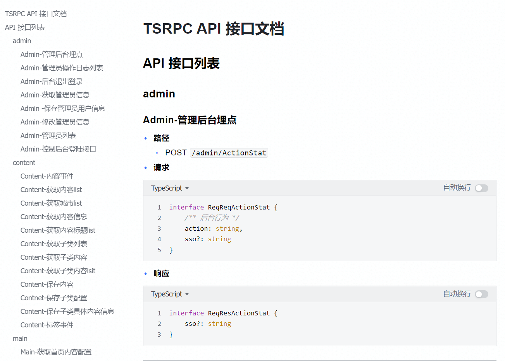
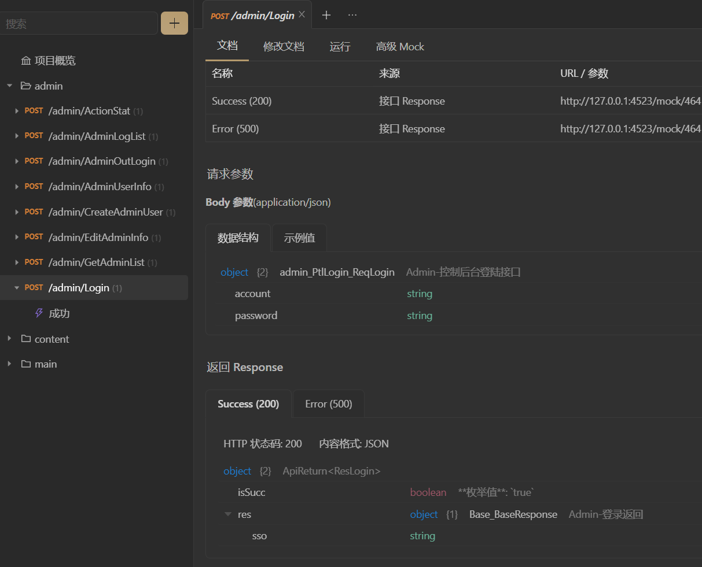

# 生成 API 文档

## 合理注释

TSRPC 支持一键生成 Swagger/OpenAPI、Markdown 等多种格式的文档。
你可以在协议上直接写 Markdown 格式的注释，注释将被作为描述信息被生成到文档之中。

- 以 `/** */` 格式编写前置注释
- 注释的第一行将作为字段、接口名称，后续行作为描述信息，支持 Markdown 格式
- 请求类型的注释将作为整个接口的注释信息

例如：

```ts
/**
 * 获取商品列表
 */
export interface ReqGetProductList {
    /**
     * 当前页码
     * 从 1 开始，默认为 1
     */
    current?: number,
    /**
     * 分页大小
     * 默认为 20
     */
    pageSize?: number
}

export interface ResGetProductList {
    /** 商品列表 */
    list: {
        /** 商品名称 */
        name: string,
        /** 商品价格 */
        price: number
    }[]
    /** 总记录条数 */
    total: number
}
```

## 生成文档

在后端项目下运行 `npm run doc` 即可生成接口文档。

```shell
cd backend
npm run doc
```

- 默认生成到 `backend/docs`，也可在 `tsrpc.config.ts` 中修改相关配置。
- 将生成 3 个文件，对应 3 种格式，可根据实际需要选用。
    - `openapi.json` Swagger / OpenAPI 3.0 格式
        - 可以直接导入现有的各种工具中使用
    - `tsapi.md` Markdown 格式
        - 适用于代码仓库或云文档展示，以 TypeScript 类型展示数据结构
        - 数据结构显示为展平引用和继承关系后的最终类型
    - `tsapi.json` TSAPI 格式 
        - 内容同 Markdown 格式，便于自定义实现文档展示 UI

如果是通过云文档分享，可以在 VSCode 中打开 Markdown 的预览模式，然后全选预览部分复制到云文档，如此复制过去的将是带格式的文本而非 Markdown 源码。

## 效果示例

### 飞书文档

（从 Markdown 预览内容复制）



### ApiFox

（OpenAPI 格式导入）

