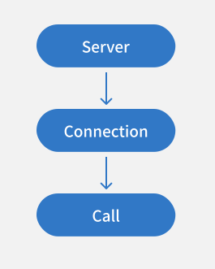

# 服务端架构

## 协议无关的三层架构

TSRPC 从一开始就被设计为 **二进制** 和 **传输协议无关** 的，这意味着你可以方便的将其扩展到原生 TCP、UDP 等其它传输协议中。
为了达到这一目的，TSRPC Server 设计为三层架构：

- **Server**：`Service` 的提供者
    - 基类是 `BaseServer`，根据实际传输协议派生出 `HttpServer`、`WsServer` 等。
- **Connection**：客户端与服务端的传输层连接，二进制的传输信道
    - 基类是 `BaseConnection`，根据实际传输协议派生出 `HttpConnection`、`WsConection` 等。
    - 在长连接下，你可以调用该对象下的 `sendMsg()` 来直接向客户端发送消息。
- **Call**：客户端发起的一次服务调用，包含了客户端发送来的所有信息
    - 基类 `ApiCall` 代表对 `ApiService` 的调用，通过该对象来获取请求和返回响应。根据实际传输协议派生出 `ApiCallHttp`、`ApiCallWs` 等。
    - 基类 `MsgCall` 代表对 `MsgService` 的调用，通过该对象来获取 Message 内容。根据实际传输协议派生出 `MsgCallHttp`、`MsgCallWs` 等。

了解它们的基类有助于你实现[类型扩展](../flow/flow#类型扩展)，你对基类扩展的所有类型，会对子类也生效。

通常，我们希望实现的 API 接口及其它功能是跨协议的，即又能运行在 HTTP 协议，也能运行在 WebSocket 协议。
所以在 API 实现中，引用的不是 `ApiCallHttp` 或 `ApiCallWs`，而是它们协议无关的基类 `ApiCall`。
如果你的接口，只工作在 WebSocket 平台，那么你可以改为引用 `ApiCallWs`，从而可以获得 WebSocket 专属的一些控制。`MsgCall`、`Connection` 同理。

:::tip
一个 `Connection` 视其传输协议，可以有一个或多个 `Call`。例如HTTP 短连接只能承载单个 `Call`，而WebSocket 长连接可以同时收发多个 `Call`。
:::

## Service

TSRPC 可以提供的服务叫做 `Service`，分为两种：
- `ApiService`：即 API 接口服务，基于请求 / 响应模式，只能由客户端发起请求，由服务端响应。
- `MsgService`：即 Message 消息服务，基于发布 / 订阅模式，可以在客户端和服务端之间双向发送消息。

:::note
`MsgService` 的双向发送仅限于长连接（如 WebSocket）。
:::

:::tip
它们的区别在于，`ApiService` 是保证可达的，无论服务端是否正确接收处理了消息，都会返回明确的响应或错误。
而 `MsgService`，单条 Message 是单方向发送，不需要返回，所以不保证对方已收到和正确处理（类似 UDP）。
:::

## 总结

总结下来，TSRPC Server 主要负责服务的实现和对外提供，通过三层架构来实现协议无关的设计。
具体代码层面的使用方式，会在本节后续的文章中一一介绍。